<div align="center">

# GLM-4.5V and GLM-4.1V-Thinking: Towards Versatile Multimodal Reasoning with Scalable Reinforcement Learning

</div>

GLM-V Team

Zhipu AI & Tsinghua University

(For the complete list of authors, please refer to the Contribution section)

## Abstract

We present GLM-4.1V-Thinking and GLM-4.5V, a family of vision-language models (VLMs) designed to advance general-purpose multimodal understanding and reasoning. In this report, we share our key findings in the development of the reasoning-centric training framework. We first develop a capable vision foundation model with significant potential through large-scale pre-training, which arguably sets the upper bound for the final performance. We then propose Reinforcement Learning with Curriculum Sampling (RLCS) to unlock the full potential of the model, leading to comprehensive capability enhancement across a diverse range of tasks, including STEM problem solving, video understanding, content recognition, coding, grounding, GUI-based agents, and long document interpretation. In a comprehensive evaluation across 42 public benchmarks, GLM-4.5V achieves state-of-the-art performance on nearly all tasks among open-source models of similar size, and demonstrates competitive or even superior results compared to closed-source models such as Gemini-2.5-Flash on challenging tasks including Coding and GUI Agents. Meanwhile, the smaller GLM-4.1V-9B-Thinking remains highly competitiveachieving superior results to the much larger Qwen2.5-VL-72B on 29 benchmarks. We open-source both GLM-4.1V-9B-Thinking and GLM-4.5V. Code, models and more information are released at https://github.com/zai-org/ GLM-V.

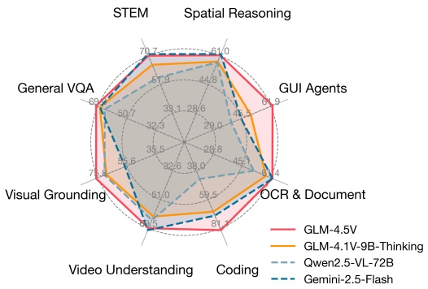

<div align="center">

(A) Comparison with baselines.

</div>

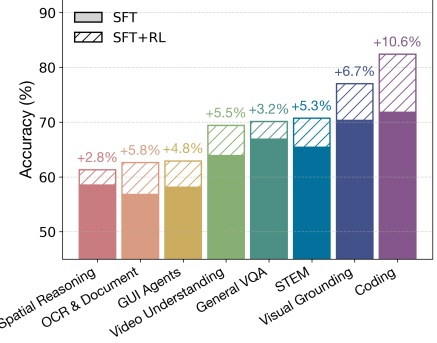

<div align="center">

(B) Reinforcement learning gains.

</div>

<div align="center">

Figure 1: (A) GLM-4.5V achieves efficient scaling based on its compact predecessor, GLM-4.1V 9B-Thinking, and compares favorably with Gemini-2.5-Flash, according to benchmark assessments. Table 2 presents full performance comparison. (B) Reinforcement learning substantially boosts the model's performance, with gains of up to +10.6% when experimented with GLM-4.5V.

</div>

## 1 Introduction

Vision-language models (VLMs) have become a crucial cornerstone of modern intelligent systems, enabling the perception and understanding of visual information beyond text. Over the past decade, as the intelligence level of models has advanced dramatically [36;47;20;4], the complexity of corresponding multimodal intelligence tasks has increased accordingly. From solving scientific problems [67;32;34] to developing autonomous agents [21;62;43], the demands on VLMs have far surpassed simple visual content perception [31], with an increasing emphasis on advanced reasoning abilities. Recently, numerous studies have shown that long-form reasoning [60] and scalable reinforcement learning [42] can significantly enhance the ability of large language models (LLMs) to solve complex problems [23;17]. Several previous works have attempted to enhance the reasoning capabilities of VLMs using similar paradigms [46;33], but they mainly focus on specific domains. The open-source community currently also lacks a multimodal reasoning model that consistently outperforms traditional non-thinking models of comparable parameter scale across a broad range of scenarios and tasks.

In this report, we share our key findings in the development of GLM-4.1V-Thinking and GLM-4.5V, a family of VLMs designed to advance general-purpose multimodal reasoning. Our training framework is structured around a unified objective: to comprehensively enhance the model's reasoning capabilities through scalable reinforcement learning. For pre-training, we curate a broad and diverse corpus of knowledge-intensive multimodal data to equip the model with strong foundational capabilities, including (a) massive image-text pairs with accurate factual knowledge; (b) a self-curated academic corpus with interleaved image and text; (c) annotated documents and diagrams, instructional videos, and grounding data spanning both natural and synthetic images. This foundation model serves as a high-potential multimodal reasoning base for subsequent reinforcement learning. In the supervised fine-tuning phase, we construct carefully designed, domain-specific datasets that teach the model to perform effective reasoning with a standardized format across a wide range of tasks. Finally, we introduce Reinforcement Learning with Curriculum Sampling (RLCS) to drive large-scale, cross-domain reasoning capabilities. RLCS is a multi-domain reinforcement learning framework that combines curriculum learning with difficulty-aware sampling to improve training efficiency by selecting tasks and samples suited to the model's current competence. Our reinforcement learning process enhances training effectiveness and stability, and systematically improves the model's reasoning abilities through interaction and feedback across diverse domains.

To advance research in this field, we open-source GLM-4.1V-9B-Thinking (9 billion parameters) and GLM-4.5V (106B-A12B: 106 billion total parameters, 12 billion activated parameters), both of which achieve state-of-the-art performance among models of comparable size. In a comprehensive evaluation across 42 public benchmarks, GLM-4.5V achieves state-of-the-art performance on nearly all tasks, consistently outperforming strong open-source models such as Step-3 (321B-A38B) and Qwen-2.5-VL-72B, and achieves comparable or even superior performance on 22 benchmarks relative to the closed-source Gemini-2.5-Flash. Notably, GLM-4.5V advances the state-of-the-art for open-source VLMs of comparable size by roughly 10% or more across a wide range of tasks, including general VQA (MMStar, GeoBench), STEM (MMMU Pro, MathVerse, WeMath), chart understanding (ChartQAPro, ChartMuseum), long document understanding (MMLongBenchDoc), visual grounding (TreeBench, Ref-L4-test), spatial reasoning (ERQA), GUI agents (OSWorld, AndroidWorld, WebVoyagerSom, WebQuest), VLM coding (Design2Code, Flame-React-Eval), and video understanding (VideoMMMU, LVBench, MotionBench). GLM-4.1V-9B-Thinking also demonstrates competitive or superior performance compared to much larger models such as Qwen2.5-VL-72B on 29 benchmarks. We further open-source the pre-trained base model, GLM-4.1V-9B-Base, to provide a strong foundation for all researchers to develop and extend their own models.

We summarize our key findings from the development process below and provide more detailed explanations in the following sections.

- Multi-domain reinforcement learning demonstrates robust cross-domain generalization and mutual facilitation. Training on one domain boosts performance in others, and joint training across domains yields even greater improvements in each. (See Section 6.3)

- Dynamically selecting the most informative rollout problems is essential for both efficiency and performance. Therefore, we propose strategies including Reinforcement Learning with Curriculum

Sampling (RLCS) and dynamic sampling expansion via ratio-based Exponential Moving Average (EMA). (See Section 5.3)

- A robust and precise reward system is critical for multi-domain RL. When training a unified VLM across diverse skills, even a slight weakness in the reward signal for one capability can collapse the entire process. (See Section 5.2)

- In summary, our contributions are as follows:

- We present GLM-4.1V-Thinking and GLM-4.5V, a family of VLMs developed to advance generalpurpose multimodal reasoning. Notably, GLM-4.5V natively supports both "thinking" and "nonthinking" modes, enabling flexible trade-offs between performance and efficiency. We introduce the model design and the reasoning-centric training framework, along with key insights and challenges encountered during the development process.

- We open-source GLM-4.1V-9B-Thinking, GLM-4.1V-9B-Base, GLM-4.5V, and other useful components such as domain-specific reward systems, to facilitate further research in this area. Code, models and more information are released at https://github.com/zai-org/GLM-V.

- Comprehensive experiments demonstrate the superiority of the proposed models: GLM-4.5V and GLM-4.1V-9B-Thinking achieve state-of-the-art performance among models of comparable size, with GLM-4.1V-9B-Thinking even surpassing much larger models on several benchmarks. Furthermore, GLM-4.5v matches or outperforms Gemini-2.5-Flash across multiple tasks.

## 2 Overview and Architecture

Figure 2 shows the shared architecture of GLM-4.1V-Thinking and GLM-4.5V, composed of three core components: a vision encoder, an MLP adapter, and a large language model (LLM) as the decoder. We employ AIMv2-Huge [9] as the initialization of the vision encoder. For the LLM component, we use GLM-4-9B-0414 [13] for the GLM-4.1V-Thinking model, and GLM-4.5-Air [13] for the GLM-4.5V model. Within the vision encoder, we adopt a strategy similar to Qwen2-VL [57], replacing the original 2D convolutions with 3D convolutions. This enables temporal downsampling by a factor of two for video inputs, thereby improving model efficiency. For single-image inputs, the image is duplicated to maintain consistency.

To enable our underlying Vision Transformer (ViT) to support arbitrary image resolutions and aspect ratios, we introduce two adaptations. First, we integrate 2D-RoPE [44] into the ViT's self-attention layers, enabling the model to effectively process images with extreme aspect ratios (over 200:1) or high resolutions (beyond 4K). Second, to preserve the foundational capabilities of the pre-trained ViT, we retain its original learnable absolute position embeddings. During training, these embeddings are dynamically adapted to variable-resolution inputs via bicubic interpolation. Specifically, for an input image divided into a grid of $ H_{p}\times W_{p} $ patches, the integer coordinates $ \mathbf{g}=(w,h) $ of each patch are first normalized to a continuous grid $ \mathbf{g}_{\mathrm{norm}} $ spanning $ [-1,1] $:

$$
\mathbf {g} _ {\mathrm {n o r m}} = \left(w _ {\mathrm {n o r m}}, h _ {\mathrm {n o r m}}\right) = 2 \cdot \left(\frac {w + 0 . 5}{W _ {p}}, \frac {h + 0 . 5}{H _ {p}}\right) - 1
$$

These normalized coordinates are then used to sample from the original position embedding table $ P_{\mathrm{orig}} $ using a bicubic interpolation function $ \mathcal{I}_{\mathrm{bicubic}} $ to generate the final adapted embedding $ P_{\mathrm{adapted}} $ for that patch:

$$
P _ {\mathrm {a d a p t e d}} (\mathbf {g}) = \mathcal {I} _ {\mathrm {b i c u b i c}} \left(P _ {\mathrm {o r i g}}, \mathbf {g} _ {\mathrm {n o r m}}\right)
$$

To further enhance spatial awareness on the language side, we extend RoPE to 3D-RoPE in the LLM. This extension provides superior spatial understanding for multimodal contexts, while preserving the original model's text-related capabilities.

After addressing spatial adaptation, we turn to temporal modeling in video inputs. For videos, we insert a time index token after each frame token, where the time index is implemented by encoding each frame's timestamp as a string. Unlike multi-image inputs, video frames form a temporally coherent sequence. This design explicitly informs the model of the real-world timestamps and temporal distances between frames, thereby boosting its temporal understanding and grounding capabilities.

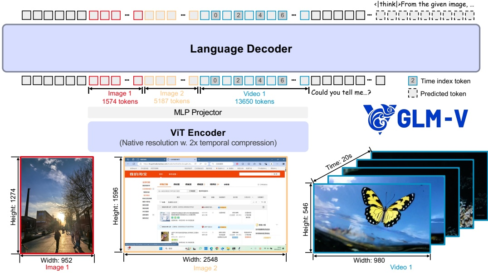

<div align="center">

Figure 2: The shared architecture of GLM-4.1V-Thinking and GLM-4.5V. The proposed model consists of three components: (1) a ViT Encoder to process and encode images and videos, (2) an MLP Projector to align visual features to textual tokens, (3) a Large Language Model as a Language Decoder to process multimodal tokens and yield token completions. Our model can perceive images and videos as their native resolutions and aspect ratios. For video inputs, additional time index tokens are inserted behind each frame to enhance the model's temporal understanding capability.

</div>

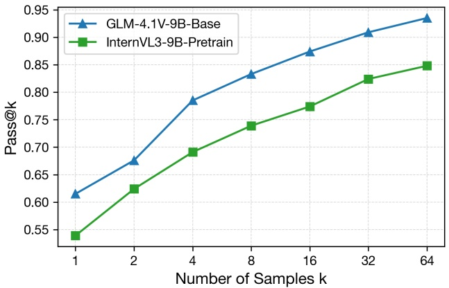

<div align="center">

Figure 3: Comparison of pass@k performance on a subset of MathVista consisting of non-multiple choice questions.

</div>

## 3 Pre-training

To develop a more powerful visual language foundation model, we incorporate a diverse range of datasets, including extensive academic corpora and knowledge-rich, interleaved image-text data, while also training the model on pure text data to preserve its language capabilities. To assess the effectiveness of our pre-training, we plot the pass@k metric on the non-multiple choice subset of MathVista. As shown in Figure 3, GLM-4.1V-9B-Base achieves significantly better results on the pass@k metric compared with the state-of-the-art pre-trained base model of similar scale. This superior base performance arguably sets the upper bound for the final results after reinforcement learning (RL). In the following sections, we first describe the construction of pre-training data and then detail the training procedure.

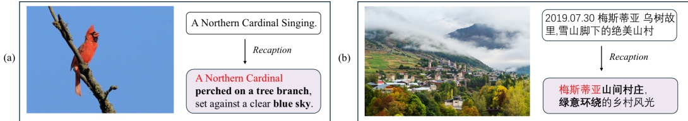

<div align="center">

Figure 4: Examples of recaption model results. The recaptioning process eliminates noise and hallucinated content from the original data, while fully retaining factual knowledge.

</div>

## 3.1 Pre-training Data

Image caption data. High-quality image-text captions are crucial for imbuing visual-language models with world knowledge and enhancing their generalization capabilities. To this end, we construct a large-scale, high-quality caption dataset through a meticulous curation pipeline. The process begins with the aggregation of an initial pool of over 10 billion image-text pairs from diverse sources, including public datasets like LAION[40], DataComp [12], DFN[8], and Wukong [14], supplemented by data from web search engines. To ensure data integrity, we implement a multi-stage refinement process:

1. Heuristic-based filtering: We first apply a series of rule-based filters to discard overtly low-quality samples. These rules include minimum image resolution, solid color detection, caption length constraints, and image-level deduplication.

2. Relevance filtering: To enforce semantic consistency between modalities, we employ a pretrained CLIP model to calculate image-text similarity, retaining only pairs with a CLIP-Score above a threshold of 0.3.

3. Concept-balanced resampling: To mitigate the inherent long-tail distribution of concepts in web-scale data, we adopt a resampling strategy inspired by MetaCLIP [63]. Using a comprehensive vocabulary rich in visual concepts and proper nouns, we re-weight the filtered data to enhance conceptual coverage and balance.

4. Factual-centered recaptioning: Furthermore, to improve the descriptive quality and information density of the captions, we iteratively train a factual-centered recaptioning model. As shown in Figure 4, this model is designed to denoise and enrich the original captions, generating new, more precise, and detailed descriptions while preserving the factual accuracy of the source text.

Finally, we merge the curated original data with the recaptioned data at a predetermined ratio, yielding a final dataset that balances broad world knowledge with rich descriptive depth.

Interleaved image-text data. Rich interleaved image-text vision-language data can be found in corpora such as web pages and books. On the one hand, its volume is immense, far exceeding that of existing image-caption datasets which rely primarily on alt-text. On the other hand, it encodes rich information beyond simple image descriptions, including complex logical relationships between text and images, and covering a broad spectrum of domain knowledge. However, such data is often extremely noisy: many samples lack genuine image-text alignment, and the distribution of information density is highly skewed (a large fraction of the corpus is uninformative). As a result, prior work seldom leverages these resources at scale to boost vision-language capabilities, typically only using small amounts to help models adapt to multi-image, interleaved-text layouts. To address this issue, we design and implement specialized processing pipelines tailored to each data source, successfully extracting a large volume of high-quality interleaved image-text data and substantially enhancing the model's foundational image-text understanding and reasoning abilities. The specific pipelines are as follows:

1. Web data processing pipeline: Our pipeline for web data begins with the aggregation of raw content from large-scale open-source datasets, including MINT [3], MMC4 [73], and OmniCorpus [29]. This initial pool undergoes a multi-stage cleaning and filtering process. First, we discard images that are semantically irrelevant to the surrounding article context using a CLIP-Score threshold. We then remove common noise elements like advertisements and QR codes, which are typically located at the end of articles, using a combination of heuristic rules

and a purpose-built image classifier for enhanced precision. Furthermore, we exclude samples characterized by a high density of images but sparse textual content, such as online photo albums. To actively enrich the dataset with high-information-value content, we iteratively train a "highknowledge-density" image classifier. This model is engineered to identify and prioritize images of significant informational value, such as academic charts, scientific illustrations, engineering schematics, instructional diagrams, and maps.

2. Academic book processing pipeline: As another core data source, we collect over 100 million digitized books. To ensure content relevance and quality, we first filter this collection to select books pertaining to key domains, including science, technology, engineering, and mathematics (STEM). Subsequently, we employ a PDF parsing tool to perform a deep parsing of these PDF documents, enabling the extraction of high-quality interleaved image-and-text content.

OCR data. To bolster the model's OCR capabilities, we construct a large-scale pre-training dataset comprising 220 million images. This dataset is meticulously composed of three distinct components each designed to address a specific aspect of text recognition:

1. Synthetic document images: We render text from language pre-training corpora using varied fonts, sizes, colors, and orientations. These rendered texts are then composited onto diverse image backgrounds sourced from the LAION dataset, producing synthetic images that cover a broad spectrum of practical application scenarios.

2. Natural scene text images: We utilize the Paddle-OCR toolkit to process a vast collection of natural images, automatically extracting textual content and their corresponding bounding boxes. The resulting data is subsequently filtered to retain only images containing at least one valid OCR detection, thereby enriching the dataset with authentic, real-world text instances.

3. Academic documents: We adopt a processing methodology inspired by Nougat [5]. A large corpus of papers is sourced from arXiv, where the LaTeX source code is first normalized and converted to HTML format using the LaTeXML tool. The HTML is then parsed and transformed into a lightweight markup language. Finally, this content is segmented according to the original PDF page breaks and rasterized, creating a high-quality dataset of paired PDF page renderings and their corresponding structured source markup.

Grounding data. To endow the model with precise visual localization capabilities, we construct a hybrid grounding dataset spanning two primary domains: natural images and graphical user interfaces (GUIs).

1. Natural image grounding: In the domain of natural images, we utilize LAION-115M [27] as a foundational dataset. Leveraging the GLIPv2 [69] model, we parse the caption of each image and automatically predict the corresponding bounding boxes for every noun phrase. To ensure the quality and richness of the grounding data, we apply a filter to retain only those samples containing at least two valid bounding boxes. This pipeline results in a final dataset of 40 million high-quality grounding annotations for natural images.

2. GUI grounding: For the GUI domain, we construct a novel, large-scale dataset from scratch. We begin by extracting URLs from a recent CommonCrawl snapshot and capturing corresponding webpage screenshots via automated tools. Going beyond static captures, we employ the Playwright framework to deeply interact with webpages. This enables us to compile and parse all visible DOM elements along with their precisely rendered bounding boxes on the page. In general, to enhance the model's interactive and comprehension abilities within GUI environments, we generate over 140 million question-answer pairs for Referring Expression Generation and Comprehension tasks specific to GUIs.

Video data. To support advanced video understanding, we construct a large-scale, high-quality video-text dataset. We curate a diverse corpus from academic, web, and proprietary sources. To address the hallucinations and omissions common in standard captions, we develop a pipeline with fine-grained human annotation to accurately capture complex actions and in-scene text. Furthermore, to encode deeper visual narratives, we annotate key cinematic elements such as camera motion and shot composition using a human-in-the-loop workflow.

To ensure data purity, we implement a rigorous filtering protocol. We begin with integrity checks to remove corrupted or invalid files. Subsequently, we employ a multimodal, embedding-based

deduplication strategy, discarding pairs where both video and text embeddings show high similarity to another entry. This process effectively eliminates semantic redundancy, resulting in a clean and efficient training corpus.

Instruction tuning data. To enhance model versatility and generalization, we diversify high-quality instruction tuning data. Three targeted strategies are implemented:

1. Task coverage and taxonomy: We design a fine-grained taxonomy to optimize data sampling for expanded world knowledge coverage. This taxonomy allows us to organize prompts according to their semantic structure and task objective, enabling category-specific preprocessing and balanced sampling strategies.

2. Complex scenario augmentation: To address gaps in existing open-source datasets (e.g., GUI interactions, long-document comprehension), we integrate synthetically generated data with rigorous structural constraints. These methods help us expand the dataset in diverse areas and improve its overall complexity.

3. Data contamination check: To prevent data leakage from public evaluation benchmarks, we conduct both manual and automated reviews of all open-source datasets.

The resulting 50 million samples include general visual perception and understanding, multimodal reasoning (e.g., STEM problem-solving), document-intensive contexts, GUI agent operations, and UI coding. It provides comprehensive coverage for the full-scenario reinforcement learning pipeline.

## 3.2 Training Recipe

Our model's training is conducted in two sequential stages: multimodal pre-training and long-context continual training.

Multimodal pre-training. The initial stage aims to build a strong foundation of general multimodal capabilities. We design specific parallelism strategies for different models. For GLM-4.1V-Thinking, we set the tensor parallel size to 2. For GLM-4.5V, we set the expert parallel size to 8 and the pipeline parallel size to 4. To ensure balanced expert utilization, we employ a loss-free routing scheme, setting the router bias update rate to 1e-3 and applying an auxiliary sequence-level balance loss with a coefficient of 1e-4. The training utilizes a sequence length of 8,192 and a global batch size of 1,536 for a total of 120,000 steps. The dataset for this stage consists of a carefully curated mixture of all data modalities described in Section 3.1, with the exception of video. To maximize computational efficiency, we employ a data packing strategy where multiple variable-length samples are concatenated into single sequences approaching the maximum length.

Long-context continual training. Following pre-training, we perform a continual training stage to extend the model's capabilities to high-resolution imagery, video, and extended contexts. We augment the training data with video inputs and long-sequence interleaved data exceeding 8k tokens. To accommodate these longer inputs, we increase the sequence length to 32,768 and enhance our parallelism strategy by setting the context parallel size to 4 in addition to the base parallel configuration. This stage is run for an additional 10,000 steps, while maintaining the global batch size of 1,536.

## 4 Supervised Fine-Tuning

The supervised fine-tuning (SFT) stage functions as a bridge that connects pre-training to reinforcement learning, transforming a base vision-language model (VLM) into one capable of long chain-of-thought (CoT) inference. Our long-CoT corpus is carefully curated to enhance reasoning style and human alignment, spanning both verifiable domains (e.g., STEM problems) and nonverifiable tasks (e.g., instruction following, open-ended writing). Unlike prior workflows [59; 20; 16] that apply SFT to short CoT data, we deliberately omit this step: rather than injecting new knowledge, we view SFT's role as aligning the model's existing vision-language understanding with a more effective thinking and response style. This alignment primes the model for a stronger cold start, enabling more efficient and stable reinforcement learning in the next phase.

## 4.1 Supervised Fine-Tuning Data

To facilitate subsequent reinforcement learning, we curate a high-quality dataset of long CoT reasoning examples. This dataset is designed to train models to produce coherent, multi-step solutions in a standardized format, thereby underpinning stable and scalable RL training.

Data composition. Our reasoning dataset spans a wide spectrum of domains, with a primary focus on verifiable tasks whose outcomes can be rigorously assessed and refined via reinforcement learning. We also include non-verifiable tasks, such as open-ended visual question answering, to broaden and strengthen the model's general reasoning capabilities across diverse contexts. The dataset is primarily composed of data in Chinese and English, with a small proportion in other languages. We employ our pre-trained model to filter out instances that are either too easy or excessively hard, maintaining a moderate overall difficulty level suitable for training.

Response formatting. Each response follows a standardized structure:

```html

<think> {think_content} </think> <answer> {answer_content} </answer>

```

The <think> part captures the model's reasoning process, including strategies such as reflection, backtracking, retrying, and verification. The <answer> part presents a concise, complete and logically sound solution. For verifiable tasks with a specific final answer, the final result in the <answer> part is required to be wrapped with <begin_of_box|> and <end_of_box|>, and only one boxed span is acceptable. This annotation facilitates more accurate answer extraction during the RL phase. Note that we include <think>, </think>, <answer>, </answer>, <begin_of_box|>, <end_of_box|> to the tokenizer's vocabulary as special tokens to facilitate easier and accurate online parsing. Note that in the responses of GLM-4.5V the special tokens <answer> and </answer> are eliminated.

Response curation. The quality of the cold-start dataset is critical to the stability of RL training. In practice, we find that poorly constructed data can lead to training instability or even collapse. To mitigate this, we implement a rigorous data cleaning pipeline. This process enforces strict adherence to formatting conventions (e.g., correct usage of <think> and <answer> tags) and removes examples with inconsistent or noisy reasoning styles. Also, we filter out responses containing mixed-language phrasing or redundant thought patterns.

Iterative data enhancement. To improve the quality and challenge level of the cold-start dataset, we incorporate high-quality and informative examples sampled from RL checkpoints back into the cold-start dataset. This iterative enhancement helps expose the model to more useful reasoning patterns discovered during RL, which in turn provide a stronger foundation for subsequent rounds of RL training.

## 4.2 Training Recipe

We perform full-parameter fine-tuning with a sequence length of 32,768 tokens and a global batch size of 32. The training corpus includes the long-form reasoning data described in $ \§4.1 $ spanning multiple domains. In addition to multimodal data, we also incorporate high-quality text-only long-form examples covering math problem solving, multi-turn conversation, agent planning, and instruction following. These examples help preserve the model's core language understanding and general reasoning abilities throughout multimodal fine-tuning.

Interestingly, we observe that even when cold-start training uses noisy reasoning data, which contain formatting inconsistencies or repetitive patterns, subsequent RL remains effective. This suggests that imperfect reasoning traces can still provide useful guidance. Nonetheless, models initialized with clean and consistent data show more stable RL convergence and achieve higher overall performance.

Different from GLM-4.1V-Thinking, which is a pure thinking model, GLM-4.5V supports both the thinking and non-thinking modes and one can flexibly switch between these two modes according to specific scenarios and requirements. In the SFT stage, we train GLM-4.5V by mixing the thinking and non-thinking data (normal CoT). Concretely, to enable non-thinking mode, we explicitly append a special token /nothink to the user prompt, and train the model to generate empty thinking content when this token is present. We found that directly using the content from the <answer> part in the thinking examples yields better results than constructing a separately curated subset for the non-thinking mode.

## 5 Reinforcement Learning: What Is Challenging and What Works

After the supervised fine-tuning phase, we primarily rely on reinforcement learning (RL) to enhance the model's performance. We employ a combination of Reinforcement Learning with Verifiable Rewards (RLVR) and Reinforcement Learning with Human Feedback (RLHF) to conduct large-scale RL across all multimodal domains and capabilities, including STEM problem solving (such as mathematics, physics, chemistry), grounding, optical character recognition (OCR), video understanding, GUI agents, chart and document understanding, logical reasoning, and instruction following.

Our RL framework comprises the following components:

- Data preparation: Define sub-tasks in each multimodal domain that are suitable for verifiable rewards (for RLVR) or model-based rewards (for RLHF) as supervision signals, and curate large volumes of high-quality data with appropriate difficulty levels and broad coverage.

- Reward system: Precise rewards are the key to RLVR's effectiveness. When scaling RL across all multimodal domains, it becomes challenging yet critical to assign accurate rewards to as many tasks as possible within each subdomain. We design a multi-domain, unified reward system that shares common evaluation logic while enabling targeted optimization of robust verifiers for each subdomain.

- Training: Building on our solid foundation of data and reward system, we meticulously refine our RL training recipes toward improved effectiveness, efficiency and stability. We propose and incorporate improvements including Reinforcement Learning with Curriculum Sampling (RLCS), dynamic sampling expansion with ratio EMA, larger batch size, discarding KL and entropy loss, etc.

- Infrastructure: To efficiently utilize compute resources for large-scale RL training, we develop an in-house high-performance, stable RL infrastructure. It flexibly supports diverse training configurations across multimodal domains (e.g., custom verifiers, data sampling ratios) and incorporates comprehensive optimizations in sampling, training, and beyond.

We find that challenges arise at every layer—from data preparation and reward system to training and infrastructure. Failure in any single dimension can lead to a severe degradation in the efficiency of the RL stage or even its collapse. In this section, we first outline the core workflow of each component, and then share the challenges we encounter during our exploration as well as the best practices we discover.

## 5.1 Data Preparation

The objective of data preparation is to select or synthesize as much verifiable data as possible in each subdomain that can be efficiently improved through RL. To this end, we carry out the following stages in sequence.

Task identification. We first define a set of candidate tasks for verification in each multimodal subdomain. For example, while video captioning is open-ended and difficult to evaluate strictly, temporal grounding lends itself to clear correctness judgments.

Data curation. We then filter or generate question-answer pairs from these tasks that a verifier can assess with high precision. This process includes converting multiple-choice questions with unique answers into the fill-in-the-blank format to eliminate noise from random guessing during RL.

Quality validation and offline difficulty grading. Next, we carry out thorough correctness checks and run passk evaluations using multiple existing or prior RL models, combining these results with human difficulty labels to achieve fine-grained difficulty grading.

Pilot RL experiments. Finally, we perform preliminary RL experiments in each subdomain to confirm the data's quality and the model's potential for performance gains.

## 5.2 Reward System

We establish a reward system compatible with both RLVR, and RLHF and tailor it for every multimodal domain. For RLVR tasks, the system first extracts the segment containing the final answer from the rollout outputs, then compares this key answer against the reference answer to determine

<div align="center">

Evolution of Rewards under a low-quality reward system:

</div>

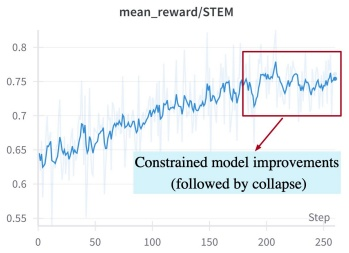

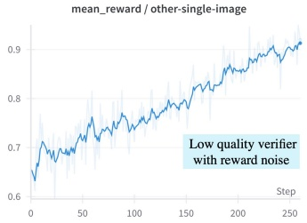

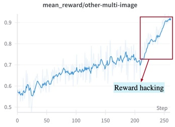

<div align="center">

Evolution of benchmark score under a low-quality reward system:

</div>

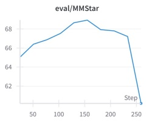

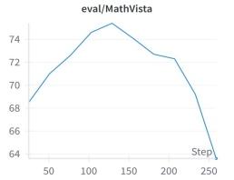

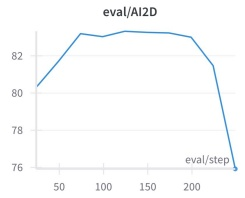

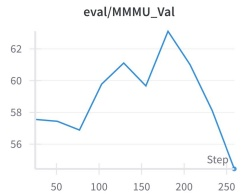

<div align="center">

Figure 5: Training reward curves (top) and evaluation metrics (bottom) when low-quality verifiers exist in some multimodal sub-domains. The STEM verifier is finely tuned, but the other-single-image and other-multi-image verifiers are not, causing: (a) Reward noise@other-single-image: The model tweaks outputs to drive rewards up without improving actual accuracy. (b) Reward hacking@other-multi-image: The model learns shortcuts that repeatedly fool the verifier, inflating rewards. After step 150, STEM reward growth stalls, the overall multimodal benchmark declines, and STEM-related benchmarks (MMMU, MathVista, AI2D) drop sharply.

</div>

correctness, and finally returns a reward value in binary (0/1) or continuous form. For RLHF tasks, it directly takes the answer segment of the output and scores it using the reward model.

As its core, reinforcement learning is an optimization process driven by the feedback from the reward system. Therefore, it's critical to enhance the accuracy and robustness of the reward system. The possibility of assigning precise rewards is also one of the key reasons why RLVR is currently delivering outstanding results. To achieve multimodal reinforcement learning across all domains, we employ a meticulously crafted reward system to supervise every facet of the model's abilities—visual perception (OCR, grounding), comprehension (document, chart and video understanding), reasoning (academic and logical problem solving), and agent behavior—thereby necessitating the development of a comprehensive, precise, and robust reward system.

Although some studies report that even random or imperfect feedback can sometimes yield benefits by steering models toward effective output patterns [41], we discover that when training a unified VLM across diverse skills, any weakness in the reward signal for a single capability can derail the entire training. As Figure 5 illustrates, even if the STEM subdomain is provided with high-quality reward, a flaw in the reward for the multi-image QA task led to model collapse across all domains. This highlights that stable, effective RL demands finely tuned, hack-resistant verifiers in every domain—any weak verifier can destabilize and collapse the entire training.

We highlight several challenges and difficulties we identified in reward model design during our experiments below, and present our corresponding optimizations and solutions.

The extraction of the final answer in RLVR. For RLVR, we first extract the final answer from the model's response and then conduct a correctness comparison. There are generally two extraction methods: rule-based extraction according to box markers and extraction via LLMs. The latter is more flexible, which doesn't force the model to emit explicit box markers around the key answer, avoiding cumbersome format tuning and preserving the original user-friendly response format. We find that for simple academic questions (where the answer is usually a single number) or single-category tasks (where the answer follows a fixed-range format), it's straightforward to design prompts that enable an LLM to extract the answer precisely. However, in our multimodal, open-domain RL setting, the diversity of questions and answers increases dramatically, making extraction significantly more complex with numerous corner cases. LLM-based extraction is often proved to be inaccurate, causing errors in the subsequent correctness judgment. Moreover, in some cases, the "answer" segment would

<div align="center">

Table 1: Domain-specific reward design in the reward system of GLM-4.1V-Thinking and GLM-4.5V.

</div>

<table border="1"><tr><td>Category</td><td>Domain</td><td>Rule</td><td>Model</td><td>Binary</td><td>Reward design details</td></tr><tr><td rowspan="3">STEM</td><td>Math</td><td>√</td><td>√</td><td>√</td><td>Numeric: numeric matching via Sympy with tolerance; Others: exact matching or LLM judge.</td></tr><tr><td>Physics</td><td>√</td><td>√</td><td>√</td><td>If physical units present, use LLM judgment; otherwise, similar to Math.</td></tr><tr><td>Chemistry</td><td>√</td><td>√</td><td>√</td><td>If chemical units present, use LLM judgment; otherwise, similar to Math.</td></tr><tr><td rowspan="3">Long DocumentChart&amp;OCR</td><td>Long Document</td><td></td><td>√</td><td>√</td><td>Semantic matching via LLM.</td></tr><tr><td>Chart</td><td>√</td><td>√</td><td>√</td><td>Numeric: similar to Math (except Year); Textual: exact match or LLM judge.</td></tr><tr><td>OCR</td><td>√</td><td></td><td></td><td>Using edit distance, reward=1- $ \frac{d_{\mathrm{edit}}(\mathrm{ans},\mathrm{gt})}{\max(|\mathrm{ans}|,|\mathrm{gt}|)}$.</td></tr><tr><td rowspan="2">General VQA</td><td>VQA</td><td>√</td><td>√</td><td>√</td><td>Try exact matching with Sympy first. If that fails, then fall back to model judgment.</td></tr><tr><td>GeoGuess</td><td>√</td><td>√</td><td></td><td>Semantic matching via LLM.</td></tr><tr><td>Visual Grounding</td><td>Grounding</td><td>√</td><td></td><td></td><td>Reward=#boxes with IoU&gt;τ divided by total boxes.</td></tr><tr><td>Spatial Rec&amp;Reasoning</td><td>Spatial</td><td></td><td>√</td><td>√</td><td>Try exact matching with Sympy first. If that fails, then fall back to model judgment.</td></tr><tr><td>GUI Agents</td><td>GUI Agent</td><td>√</td><td>√</td><td></td><td>Action prediction: action+IoU; Grounding: IoU; QA: exact or semantic matching.</td></tr><tr><td>Video</td><td>Video</td><td>√</td><td>√</td><td>√</td><td>Exact matching, or semantic matching via LLM judge.</td></tr></table>

loop or become excessively long, which is difficult or out-of-distribution for LLMs to extract the final answer, further undermining model-based extraction accuracy. To address these issues, we require the model during RLVR to explicitly mark the final answer with box tokens, and compare only the boxed content against the reference answer.

It is worth noting that many prior works use the \boxed{} label to denote final answers. However, when reference answers become complex (for example, the results of GUI agent tasks are expressed as complex function calls), \boxed{} can be ambiguous and difficult to parse automatically. Therefore, we introduced special tokens into the vocabulary and instead mark answer spans as: <|begin_of_box|>{FINAL_ANSWER}|<|end_of_box|>.

Avoid reward hacking. A coarse or incomplete reward design can lead the model to discover shortcuts for boosting its reward rather than truly improving its task performance. For example, in pilot experiments, we find that after more than 500 training iterations, an imprudently designed verifier could be hacked as follows: for a counting problem, the model would answer "a correct number between 0 and 10", and for a relativity question about speed, it would answer "a velocity very close to the speed of light" - responses that successfully fool some LLM-based reward models and get high reward.

Domain-specific reward system. The optimal verifier varies between multimodal subdomains and is tightly coupled to the task—for instance, "43" and "43.0" are equivalent in a math problem but not in an OCR context. To deliver more accurate rewards across all domains, we develop a domain-specific reward system with the following features:

- Shared verification functions: Common checks—such as format validation, boxed content extraction, and exact matching—are implemented as reusable functions to streamline development.

- Domain-specific modules: Each domain has its own submodule supporting complex verification logic, including branching workflows, functional evaluations, and model-based judgments driven by custom judge prompts and hyperparameters.

- Unit testing: To validate the reward system in each domain, we recommend defining unit tests that target that domain's output distribution and iteratively refining the reward logic based on test results.

For example, in chart QA, numeric answers are verified against a relative tolerance threshold; for textual answers, we first check for an exact match and, if none is found, fall back to an LLM-based semantic equivalence assessment. We summarize some of our domain-specific verifiers below, and open-source this reward system in our GitHub repository to support further academic research.

Beyond the domain-specific content checking above, we also build a format-and-style-checking reward system using both rule-based and model-based judgments. In format checking any response to non-verifiable data whose answer> content contains the special markers <begin_of_box|> <|end_of_box|> is penalized with a minimal reward. For style checking, we similarly assign a low reward if the think> content or answer> content includes extensive mixed Chinese and English segments or large blocks of repetitive text. In addition, a text-based reward

model evaluates the <answer> content for instruction compliance and fluency, encouraging outputs that adhere closely to the prompt while remaining coherent and logically rigorous.

## 5.3 Reinforcement Learning with Curriculum Sampling (RLCS)

During RL training, we blend data from each multimodal domain in predetermined proportions, verify every domain using the reward system described in section 5.2, and optimize with GRPO [42] objective. To ensure that GLM-4.1V-Thinking and GLM-4.5V reaches its full potential for each multimodal subdomain, we first run pilot experiments on each subdomain to evaluate its training difficulty, performance-improvement potential and the required training tokens in the corresponding dataset. These insights guide the allocation of training data proportions in the RL process.

One challenge is that, as RL training progresses, the model's effective learning efficiency inevitably declines as its capabilities improve: many examples become too trivial to drive further learning. For instance, in GRPO, a rollout batch in which all samples are answered correctly yields no useful gradient. In our pilot experiment, over half of all prompts achieve accuracy over 90% after just 200 training steps. Meanwhile, rollout efficiency remains the primary bottleneck: the bulk of training time is consumed by rollouts. Consequently, it is essential to select the most informative, appropriately challenging problems for rollout.

To maximize learning efficiency, we propose Reinforcement Learning with Curriculum Sampling (RLCS), which applies the insight of curriculum learning to online sampling. We employ an adaptive curriculum that continuously adjusts the difficulty of training samples to match the model's evolving capabilities, ensuring each update is maximally informative. To achieve this, we evaluate sample difficulty both offline and online. Before training, we assess the inherent difficulty of every sample by running pass@k evaluations across the full dataset with several established vision-language models (or earlier RL checkpoints) and merging those quantitative scores with expert human difficulty annotations. This process yields a set of fine-grained difficulty labels that partition our data into multiple tiers, from very easy through very hard. During training, we perform online difficulty grading. For each generated rollout, we record the pass@k outcome, map it to its corresponding difficulty tier, and merge these results with our offline labels. This online difficulty distribution also offers valuable insights into the model's current performance.

By leveraging these difficulty labels alongside the model's subcategory performance, we continuously re-weight the sampling ratios of different difficulty categories at the granularity of training iterations. The core idea is to down-sample examples that are too trivial, as well as those that currently prove too challenging, and boost exposure to the mid-range difficulties where the model gains the most. Empirically, we observe that RLCS significantly accelerates model improvement and consistently leads to performance gains.

Besides, we make particular efforts to improve the effectiveness, efficiency, and stability of RLCS. Here, we share as comprehensively as possible the lessons learned, insights gained, and methods developed in optimizing the training process.

## 5.3.1 Improving Effectiveness

To improve the performance upper bound of multimodal reinforcement learning, we propose and incorporate the following enhancements:

- Larger batch size. When mixing multi-domain multimodal data during training, a relatively large batch size is recommended to achieve a higher performance ceiling in the long run.

- Dynamic sampling expansion via ratio EMA. In GRPO, when both entropy and KL losses are removed, a rollout batch composed entirely of correct or entirely of incorrect samples provides no useful gradient. In other words, the all-correct/incorrect prompts reduce the usable batch size. As the proportion of these all-correct or all-incorrect batches grows or fluctuates, the effective batch size can vary wildly, degrading training stability. To address this, we perform rollouts with an intentional oversampling factor expansion_ratio, and then select the subset of samples whose difficulty is most balanced (i.e., with the numbers of correct and incorrect responses as close as possible). Concretely, for each rollout, we compute the expansion ratio as expansion_ratio = 1/（1- not_valid_sample_rate), where not_valid_sample_rate denotes the fraction of samples that are all-correct or all-incorrect in the last iteration. We then maintain an exponential

moving average, expansion_ratio_ema, of this ratio and use it as the oversampling coefficient in the next iteration. Compared to [66], this method predetermines the total number of rollout samples, facilitating parallel sampling and balanced rollout allocation, which aligns more closely with the underlying large-scale RL infrastructure for greater efficiency.

- Force answering. When the thinking process becomes excessively long, it may be truncated by the rollout length limit. Because the model then fails to produce an answer, it is typically assigned a reward of zero. However, such lengthy reasoning isn't necessarily incorrect for difficult questions, the generated part of an overlong thinking path can be perfectly valid. Truncating in this way not only wastes rollout budget but also injects noise into training. To address this, we enforce a forced truncation by inserting a </think> token, which prompts the model to emit a final answer and allows us to award a fair reward for its reasoning [64]. We found that this method encourages the model to learn how to provide an appropriate answer after any amount of thinking, facilitating dynamic control of the thinking budget at test time.

- Discard KL loss. Compared to text-only models, vision-language models usually experience a faster increase in KL divergence during reinforcement learning. However, when we apply a KL loss to explicitly suppress this increase, the model's capabilities are noticeably constrained. Therefore, we remove the KL loss.

- Clip-higher. In multimodal RL, similar to [66], increasing the upper clipping bound of the importance sampling ratio also proved useful for improving both off-policy performance and preventing excessive entropy collapse.

- We also share our observations and insights gained from large-scale cross-domain reinforcement learning. We believe that these insights can help improve the RL effectiveness in the future.

- The peak performance in the RL phase does not perfectly correlate with a cold-start SFT model's performance. For instance, in one of our experiments, increasing cold-start training from 1,000 to 2,000 steps boosts the post-cold-start performance by about two points on average. However, after RL, both checkpoints converge to nearly the same performance. In other words, a higher score after cold-start does not guarantee greater RL potential; with proper training, RL can elevate base models of equal inherent potential to the same peak.

- Domain interference in RL is less pronounced than in SFT. Performance on under- or untrained domains that are orthogonal to the RL training domain can be preserved quite well. Moreover, cross-domain generalization, where improvements in one domain transfer to others, is frequently observed.

## 5.3.2 Improving Stability

To enhance training robustness and prevent collapse during RL, we identified several key factors that significantly impact stability throughout the training pipeline:

- The quality of cold-start SFT data has a critical impact on training stability. Therefore, it is strongly recommended to maintain the cold-start data quality above a certain threshold. For example, if the cold-start data contains a large amount of meaningless thinking paths, the resulting model exhibits severe instability during RL training or even leads to training collapse.

- We found that incorporating an entropy loss to promote diversity could cause the model to produce garbled output, which eventually leads to training collapse, so we removed the entropy loss.

- During rollouts, using top-p = 1 instead of a smaller value produces more stable RL training. Although some prior works advocate lowering top-p (e.g. to 0.9) to reduce variance and stabilize rollouts, we observe that this actually increases the risk of garbling over time. In contrast, setting top-p to 1 eliminates the garbled outputs that tend to appear in later iterations. We hypothesize that top-p = 1 ensures full vocabulary coverage, preventing the under-learning of rare tokens and thus maintaining clean output. While this choice does introduce more randomness during sampling, it ultimately enhances both stability and performance in the RL phase.

- We compared per-sample (averaging tokens' loss within each sample, then averaging across samples) and per-token (averaging all tokens' loss within a batch, then averaging across batches) loss computation methods and observed no significant difference in mean reward, but per-sample loss computation yielded more stable training.

- Although format-based rewards during RL can help nudge outputs toward the correct structure, we strongly recommend that the model fully learn the required output format during the cold-start phase rather than depending on RL. In our experience, if the format errors frequently occur, the mixture of format and correctness reward may destabilize training.

## 5.4 Infrastructure

To maximize RL training efficiency and performance, we extensively optimize our RL infrastructure focusing on the following components:

- Load balancing of sequence lengths across DP ranks. Since the rollout length of each sample is unknown beforehand, some ranks may be assigned many extremely long sequences (e.g., video or long-document prompts, or difficult problems with long responses). Without balancing total sequence length across DP (Data Parallel) ranks, the slowest rank dictates the overall training speed. To address this, after rollout and before assigning training samples to each DP rank, we balance both sequence length and compute load across ranks so that forward-backward passes per rank remain within a tight range, thereby maximizing throughput.

- Intra-rank training with sequence packing and gradient accumulation. Because sample lengths vary unpredictably in RL, we cannot know in advance how many forward passes each DP rank will perform. We solve this by combining sequence packing with gradient accumulation: each optimization step comprises multiple micro-steps of forward and backward passes, where each micro-step packs several samples into a fixed-length sequence of length context_length = 32K, padding unused positions. During training, we weight and average micro-step gradients by sample count, which is mathematically equivalent to computing gradients over the entire rollout batch at once.

- Sample packing and reorganization within DP ranks. Building on the previous strategy, training is decoupled from the number of samples per forward-backward pass. We therefore apply an efficient sample re-packing heuristic to complete all samples in as few micro-steps as possible. In practice, this optimization halves our forward-backward time.

- Dynamic sampling expansion via ratio EMA. To oversample and then select moderately difficult examples, we propose and implement dynamic sampling expansion via ratio EMA algorithm, which is detailed in section 5.3.1. Our approach precomputes the required sample count for parallel rollout, greatly improving efficiency.

## 6 Evaluation

In this section, we present the evaluation details and results of GLM-4.5V (including both thinking and non-thinking modes) and GLM-4.1V-Thinking (Appendix C). In $ \mathrm{S 6.1} $ , we show the comprehensive evaluation setting and the full quantitative comparison results are listed in $ \mathrm{S 6.2} $ .

## 6.1 Evaluation Setting

Benchmarks. To comprehensively assess the capabilities of our models, we conduct evaluations across 42 public benchmarks, covering eight distinct categories: General VQA, STEM, OCR & Document, Visual Grounding, Spatial Reasoning, GUI Agents, Coding, and Video Understanding. The following benchmarks are used for evaluation:

- General VQA: MMBench-V1.1 [30], MMStar [7], BLINK(val) [11], MUIRBENCH [53], ZeroBench(val) [39], HallusionBench [15], GeoBench [2];

- STEM: MMMU(val) [67], MMMU Pro [68], MathVista [32], MathVision [55], MathVerse [70], DynaMath [74], LogicVista [61], WeMath [37], AI2D [26];

- OCR,Chart & Document: OCRBench [31],ChartQAPro [35],ChartMuseum [45], MMLongBench-Doc [34];

- Visual Grounding: RefCOCO-avg (val) [25], TreeBench [54], Ref-L4 [6];

- GUI Agents: OSWorld [62], Android World [38], WebVoyager Some [18], Webquest-QA [56];

- **Coding:** Design2Code [43], Flame-React-Eval [1];

<table border="1"><tr><td>Task</td><td>Benchmark</td><td>GLM-4.1V</td><td>GLM-4.5V</td><td>GLM-4.5V</td><td>Step-3</td><td>Qwen2.5-VL</td><td>Kimi-VL-2506</td><td>Gemma-3</td></tr><tr><td>Size Mode</td><td></td><td>9B thinking</td><td>106B(A12B) non-thinking</td><td>106B(A12B) thinking</td><td>321B(A38B) thinking</td><td>72B non-thinking</td><td>16B(A3B) thinking</td><td>27B non-thinking</td></tr><tr><td rowspan="9">General VQA</td><td>MMBenchV1.1</td><td>85.8</td><td>86.7</td><td>88.2</td><td>81.1*</td><td>88.0</td><td>84.4</td><td>80.1*</td></tr><tr><td>MMBenchV1.1(CN)</td><td>84.7</td><td>86.5</td><td>88.3</td><td>81.5*</td><td>86.7*</td><td>80.7*</td><td>84.8*</td></tr><tr><td>MMStar</td><td>72.9</td><td>73.4</td><td>75.3</td><td>69.0*</td><td>70.8</td><td>70.4</td><td>60.0*</td></tr><tr><td>BLINK(Val)</td><td>65.1</td><td>63.7</td><td>65.3</td><td>62.7*</td><td>58.0*</td><td>53.5*</td><td>52.9*</td></tr><tr><td>MUIRBENCH</td><td>74.7</td><td>71.1</td><td>75.3</td><td>75.0*</td><td>62.9*</td><td>63.8*</td><td>50.3*</td></tr><tr><td>HallusionBench</td><td>63.2</td><td>59.1</td><td>65.4</td><td>64.2</td><td>56.8*</td><td>59.8*</td><td>45.8*</td></tr><tr><td>ZeroBench(sub)</td><td>19.2</td><td>21.9</td><td>23.4</td><td>23.0</td><td>19.5*</td><td>16.2*</td><td>17.7*</td></tr><tr><td>GeoBench1</td><td>76.0</td><td>78.4</td><td>79.7</td><td>72.9*</td><td>74.3*</td><td>48.0*</td><td>57.5*</td></tr><tr><td rowspan="9">STEM</td><td>MMMU(Val)</td><td>68.0</td><td>68.4</td><td>75.4</td><td>74.2</td><td>70.2</td><td>64.0</td><td>62.0*</td></tr><tr><td>MMMUPro</td><td>57.1</td><td>59.8</td><td>65.2</td><td>58.6</td><td>51.1</td><td>46.3</td><td>37.4*</td></tr><tr><td>MathVista</td><td>80.7</td><td>78.2</td><td>84.6</td><td>79.2*</td><td>74.8</td><td>80.1</td><td>64.3*</td></tr><tr><td>MathVision</td><td>54.4</td><td>52.5</td><td>65.6</td><td>64.8</td><td>38.1</td><td>54.4*</td><td>39.8*</td></tr><tr><td>MathVerse</td><td>68.4</td><td>65.4</td><td>72.1</td><td>62.7*</td><td>47.8*</td><td>54.6*</td><td>34.0*</td></tr><tr><td>DynaMath</td><td>42.5</td><td>44.1</td><td>53.9</td><td>50.1</td><td>36.1*</td><td>28.1*</td><td>28.5*</td></tr><tr><td>LogicVista</td><td>60.4</td><td>54.8</td><td>62.4</td><td>60.2*</td><td>56.2*</td><td>51.4*</td><td>47.3*</td></tr><tr><td>AI2D</td><td>87.9</td><td>86.6</td><td>88.1</td><td>83.7*</td><td>87.6*</td><td>81.9*</td><td>80.2*</td></tr><tr><td>WeMath</td><td>63.8</td><td>58.9</td><td>68.8</td><td>59.8</td><td>46.0*</td><td>42.0*</td><td>37.9*</td></tr><tr><td rowspan="4">Long Document, OCR&amp;Chart</td><td>MMLongBench-Doc</td><td>42.4</td><td>41.1</td><td>44.7</td><td>31.8*</td><td>35.2*</td><td>42.1</td><td>28.4*</td></tr><tr><td>OCRBench</td><td>84.2</td><td>87.2</td><td>86.5</td><td>83.7*</td><td>85.1*</td><td>86.9</td><td>75.9*</td></tr><tr><td>ChartQAPro</td><td>59.5</td><td>54.2</td><td>64.0</td><td>56.4*</td><td>46.7*</td><td>23.7*</td><td>37.6*</td></tr><tr><td>ChartMuseum</td><td>48.8</td><td>47.1</td><td>55.3</td><td>40.0*</td><td>39.6*</td><td>33.6*</td><td>23.9*</td></tr><tr><td rowspan="3">Visual Grounding</td><td>RefCOCO-avg(val)</td><td>85.3</td><td>91.5</td><td>91.3</td><td>20.2*</td><td>90.3</td><td>33.6*</td><td>2.4*</td></tr><tr><td>TreeBench</td><td>37.5</td><td>47.9</td><td>50.1</td><td>41.3*</td><td>42.3</td><td>41.5*</td><td>33.8*</td></tr><tr><td>Ref-L4-test</td><td>86.8</td><td>89.5</td><td>89.5</td><td>12.2*</td><td>80.8*</td><td>51.3*</td><td>2.5*</td></tr><tr><td rowspan="4">Spatial Reco&amp;Reasoning</td><td>OmniSpatial</td><td>47.7</td><td>49.6</td><td>51.0</td><td>47.0*</td><td>47.9</td><td>37.3*</td><td>40.8*</td></tr><tr><td>CV-Bench</td><td>85.0</td><td>86.5</td><td>87.3</td><td>80.9*</td><td>82.0*</td><td>79.1*</td><td>74.6*</td></tr><tr><td>ERQA</td><td>45.8</td><td>46.5</td><td>50.0</td><td>44.5*</td><td>44.8*</td><td>36.0*</td><td>37.5*</td></tr><tr><td>All-Angles Bench</td><td>52.7</td><td>54.3</td><td>56.9</td><td>52.4*</td><td>54.4*</td><td>48.9*</td><td>48.2*</td></tr><tr><td rowspan="5">GUI Agents</td><td>OSWorld2</td><td>14.9</td><td>31.8</td><td>35.8</td><td>-</td><td>8.8</td><td>8.2</td><td>6.2*</td></tr><tr><td>AndroidWorld</td><td>41.7</td><td>57.0</td><td>57.0</td><td>-</td><td>35.0</td><td>-</td><td>4.4*</td></tr><tr><td>WebVoyager2</td><td>69.0</td><td>75.9</td><td>84.4</td><td>-</td><td>40.4*</td><td>-</td><td>34.8*</td></tr><tr><td>Webquest-SingleQA</td><td>72.1</td><td>73.3</td><td>76.9</td><td>58.7*</td><td>60.5*</td><td>35.6*</td><td>31.2*</td></tr><tr><td>Webquest-MultiQA</td><td>54.7</td><td>53.8</td><td>60.6</td><td>52.8*</td><td>52.1*</td><td>11.1*</td><td>36.5*</td></tr><tr><td rowspan="2">Coding</td><td>Design2Code</td><td>64.7</td><td>84.5</td><td>82.2</td><td>34.1*</td><td>41.9*</td><td>38.8*</td><td>16.1*</td></tr><tr><td>Flame-React-Eval</td><td>72.5</td><td>78.8</td><td>82.5</td><td>63.8*</td><td>46.3*</td><td>36.3*</td><td>27.5*</td></tr><tr><td rowspan="7">Video Understanding</td><td>VideoMME(w/o sub)</td><td>68.2</td><td>74.3</td><td>74.6</td><td>-</td><td>73.3</td><td>67.8</td><td>58.9*</td></tr><tr><td>VideoMME(w/sub)</td><td>73.6</td><td>80.0</td><td>80.7</td><td>-</td><td>79.1</td><td>71.9</td><td>68.4*</td></tr><tr><td>MMVU</td><td>59.4</td><td>64.8</td><td>68.7</td><td>-</td><td>62.9</td><td>57.5</td><td>57.7*</td></tr><tr><td>VideoMMMU</td><td>61.0</td><td>67.5</td><td>72.4</td><td>-</td><td>60.2</td><td>65.2</td><td>54.5*</td></tr><tr><td>LVBench</td><td>44.0</td><td>56.2</td><td>53.8</td><td>-</td><td>47.3</td><td>47.6*</td><td>45.9*</td></tr><tr><td>MotionBench</td><td>59.0</td><td>61.8</td><td>62.4</td><td>-</td><td>56.1*</td><td>54.3*</td><td>47.8*</td></tr><tr><td>MVBench</td><td>68.4</td><td>73.4</td><td>73.0</td><td>-</td><td>70.4</td><td>59.7*</td><td>43.5*</td></tr></table>

<div align="center">

Table 2: Benchmark evaluation of GLM-4.5V, GLM-4.1V-Thinking and other open-sourced VLMs on diverse visual-language benchmarks. Results marked with " $ \cdot $ " correspond to our reproduced results, " - " indicates the corresponding models are not competent for such tasks or datasets, while those labeled with " $ \dagger $ " are reported by third-party sources. The best results among open-source models are bolded. Refer to Table 3 for the detailed comparison of GLM-4.1V-9B-Thinking with baselines under 10B parameters.

</div>

- Spatial Reco & Reasoning: OminiSpatial [24], CV-Bench [51], ERQA [49], All-Angles Bench [65];

- Video Understanding: VideoMME [10], MMVU [71], VideoMMMU [22], LVBench [58], MotionBench [19], MVBench [28];

Setting. We mostly use vLLM as the backend for model inference. For faster and more stable inference, we use SGLang for video inference. The maximum output length for each model response is set to 8,192 tokens. For visual input configuration, we set the maximum expected length for image inputs to 6,144 tokens, and 48,000 tokens for video benchmarks. The predicted answer is extracted as the string enclosed within special boxed tokens ( $ < | \mathrm{b e g i n\_o f\_b o x} | >... < | \mathrm{e n d\_o f\_b o x} | > $ ), which we define as the model's final output. For benchmarks that require answer extraction or scoring by a language model, we consistently use GPT-4o (2024-11-20) [36] for this purpose. To ensure fairness, all models—including GLM-4.1V-9B-Thinking and its open-source counterparts—are evaluated using the same toolchain, policies, and prompt templates. For each model, we enforce a minimum successful request rate of 95% on every benchmark. Samples that fail due to generation errors or API issues are excluded from scoring, ensuring that final metrics reflect only valid outputs.

Evaluation protocol and instructions. We detail the evaluation protocols for VLM coding, GUI agents, and grounding in Appendix B, as these tasks may involve domain-specific formats, instructions, and evaluation protocols.

## 6.2 Comparison to Other Advanced MLLMs

We compare GLM-4.5V and GLM-4.1V-9B-Thinking against a wide range of open-source state-of the-art MLLMs, including Step-3 [52], Qwen-VL series [4], Kimi-VL [50] and Gemma-3 [48]. As shown in Table 2, GLM-4.5V establishes a new state-of-the-art among open-source models across all benchmarks, demonstrating consistent superiority in performance across a wide spectrum of multimodal tasks.

In the domain of General VQA, GLM-4.5V-Thinking surpasses all competing open-source models of comparable size on diverse benchmarks, covering both single-image and multi-image settings. This underscores the model's strong general-purpose visual reasoning capabilities and its adeptness in both factual and inferential question answering across varying visual contexts.

Within the STEM category, our model achieves the highest performance on challenging science and engineering benchmarks such as MMMU (Val), MMMU Pro, and AI2D. These results indicate a particularly strong capacity for structured and domain-specific reasoning. On mathematics-centric tasks such as MathVista and WeMath, GLM-4.5V-Thinking also outperforms other baselines, demonstrating advanced capability in symbolic and arithmetic reasoning.

In the domain of OCR & Document, GLM-4.5V-Thinking sets new state-of-the-art scores on both ChartQAPro and ChartMuseum, demonstrating strong capabilities in structured data extraction from plots and charts. On OCRBench, it performs competitively, slightly behind our non-thinking version and Kimi-VL, indicating solid but improvable text recognition in natural images. Moreover, GLM 4.5V-Thinking outperforms all other models on MMLongBench-Doc, revealing a strong capacity for reasoning over extended sequences, maintaining cross-page coherence, and handling complex document layouts.

GLM-4.5V-Thinking also establishes new state-of-the-art results in emerging tasks involving GUI Agents and multimodal Coding. Its significant margin over competitors in these areas highlights its strong cross-modal reasoning ability and semantic alignment between visual interfaces and code representations.

In the area of Video Understanding and Spatial Reasoning, GLM-4.5V-Thinking demonstrates robust performance, leading on benchmarks such as VideoMME, MMVU, and OminiSpatial. These results emphasize its advanced spatio-temporal reasoning abilities, crucial for interpreting dynamic and multi-frame visual content. Meanwhile, for Visual Grounding, the model delivers solid results on RefCOCO, outperforming other competitors.

Remarkably, despite the relatively compact size, GLM-4.1V-9B-Thinking demonstrates superior performance to the much larger Qwen2.5-VL-72B model on 29 out of 42 benchmarks, including particularly challenging tasks such as MMStar, MUIRBENCH, MMMU Pro, and ChartMuseum. This illustrates the superior efficiency and capability of our model, making it a compelling choice for real-world deployment where computational resources are constrained. These findings emphasize that our model offers an excellent trade-off between performance and efficiency, making it a practical and powerful solution for real-world deployment under resource constraints.

## 6.3 Investigating Cross-Domain Generalization in Reinforcement Learning

While multi-domain RL successfully improves the overall performance, there is one remaining question: In the course of RL, is it possible for the various multimodal domains to generalize to and reinforce one another, or will they instead antagonize and interfere with each other? To explore this question, we conduct experiments on GLM-4.1V-9B-Thinking. We selected four representative domains: STEM, OCR & Chart, Grounding, and GUI agents. While each domain relies on a common toolkit of visual perception, reasoning, they stress different abilities. For example, Grounding demands fine-grained pixel-level perception; OCR & Chart emphasizes text recognition and the interpretation of abstract figures; STEM tasks center on complex visual reasoning; and GUI agents require a blend of UI understanding, real-world knowledge, and dynamic decision-making.

All experiments are conducted based on the SFT-stage checkpoint of GLM-4.1V-9B-Thinking. We compare 5 groups of RL training data: (1) STEM, (2) OCR & Chart, (3) Grounding, (4) GUI Agent, and (5) Mix-all which mixes all four data groups above with the RL training ratio of GLM-4.1V-9B- Thinking. We adopt the mix-all setup as our reference for training data volume: for each standalone RL experiment on a given sub-domain, the number of samples processed is exactly the same as the number that sub-domain sees in the mix-all experiment. After training, we evaluate models on 5 categories of benchmarks, each category contains multiple benchmarks: (1) STEM, (2) OCR & Chart, (3) Grounding, (4) GUI Agent, and (5) General image VQA that does not have a corresponding training set. The results are shown in Figure 6, where the numbers represent the improvement of the average group score compared to the initial SFT checkpoint. The results demonstrate robust cross-domain generalization and mutual facilitation in most domains:

- Training on one domain boosts performance in others. For example, reinforcement learning on STEM data not only improves STEM-specific skills but also enhances performance on visual grounding, GUI-agent interaction, and general VQA tasks. Similarly, training on OCR & Chart data yields gains in STEM, GUI-agent, and general VQA benchmarks. This crossdomain effect reveals that shared underlying capabilities such as visual understanding, text recognition, and reasoning can be co-activated and refined through a single-domain RL signal. Intriguingly, RL applied exclusively to GUI-agent tasks produces improvements across all evaluated domains, indicating that GUI-agent challenges intrinsically require a comprehensive mix of text recognition, visual grounding, and logical reasoning that transfers broadly.

- Joint training across domains yields even greater improvements in each. This synergy likely underpins GLM-4.1V-9B-Thinking's extraordinary performance. Among all configurations, the "mix-all" setting where the model is trained simultaneously on every domain delivers clear gains over any single-domain RL in three out of five areas (STEM, OCR & Chart, and general VQA). Notably, however, mixed-domain training does not improve grounding or GUI-agent performance, suggesting that these domains may require more targeted or specialized multi-domain strategies and warrant further exploration.

Interestingly, the cross-domain RL results also reveal how closely related these tasks are. For example, training on GUI-agent data markedly improves grounding performance and vice versa, highlighting their shared reliance on visual grounding capabilities. Likewise, OCR & Chart and GUI-agent tasks boost each other's performance, reflecting their common demand for accurate text recognition.

## 7 Discussion: Limitations and Future Work

GLM-4.1V-Thinking and GLM-4.5V represent our firm steps in pursuit of general-purpose multimodal reasoning. Developed under a reasoning-centric training framework that unifies pre-training, supervised fine-tuning, and reinforcement learning around a shared objective, the models successfully

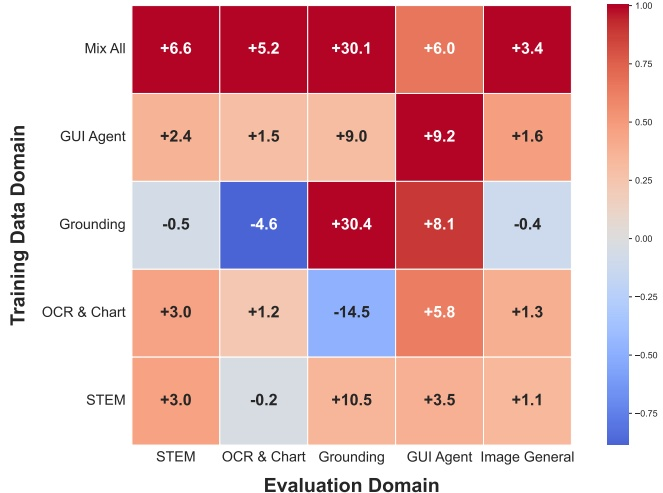

<div align="center">

Figure 6: Cross-domain generalization in reinforcement learning. We evaluate the SFT-stage models across five RL data settings: STEM, OCR & Chart, grounding, GUI agent, and a combined "Mix-all". Each model is tested on five benchmark suites corresponding to these domains. The values in the grid show the average performance improvement per domain (negative values indicate a decline), and the cell colors are normalized within each domain.

</div>

learn to reason across visual, textual, mathematical, scientific, and agentic domains. The resulting 9B-parameter dense model and 106B A12B-parameter MoE model achieve strong performance across diverse benchmarks, achieving SOTA performance among models of comparable size. We open-source GLM-4.1V-Thinking and GLM-4.5V to facilitate further research in the direction of multimodal reasoning.

Despite notable progresses have been made, several limitations remain. First, although RL enhances task completion rates, it does not consistently improve reasoning quality. In certain instances, the model produces correct answers but relies on incorrect reasoning steps. This issue arises because current reward models typically evaluate final outcomes without verifying intermediate reasoning steps. Consequently, flawed or even hallucinated reasoning chains may inadvertently be reinforced if they lead to correct answers. This emphasizes the importance of designing reward mechanisms that can effectively evaluate the reasoning process, not just the outcome.

Second, RL training can exhibit instability. Early experiments demonstrated that minor changes in the setup could lead to substantial variations in reasoning depth or output style. Although advancements in later versions, such as improved reward design and enhanced cold-start data, have led to more stable training, the remaining sensitivity indicates deeper challenges in large-scale RL optimization. Further modifications in RL are needed to improve consistency and robustness.

Third, despite the strong performance of GLM-4.1V-Thinking and GLM-4.5V across diverse tasks, they might still struggle in complex scenarios. For example, images involving clutters, occluded objects, or ambiguous visual details could cause perceptual errors that undermine the reasoning capability of the models. Under these conditions, the models may resort to guesswork or generic assumptions rather than engaging in grounded inference. This suggests that improvements in perception and reasoning must progress simultaneously, as these components are intricately interconnected.

Looking ahead, a key direction is to improve how we supervise and evaluate model reasoning. Future reward models should assess not only final answers but also intermediate reasoning steps, actively detecting hallucinations and flagging logical inconsistencies. Additionally, for tasks with subjective evaluations, it is crucial to explore strategies to prevent reward hacking, a necessary step toward achieving general-purpose intelligence.

We are also interested in the potential benefits of multimodal training for text-only reasoning tasks. For instance, understanding whether visual reasoning tasks, such as interpreting code in images, can enhance the performance of text-only coding tasks is a promising research direction. Exploring how

vision and language modalities mutually reinforce each other may lead to significant advances in general reasoning capabilities.

Finally, as model capabilities improve, evaluation frameworks must evolve correspondingly. Many current benchmarks are reaching saturation or fail to effectively identify critical errors, such as hallucination in reasoning chains. Future benchmarks should be both more challenging and diagnostic, designed to explicitly detect more failure modes such as shortcut reasoning or hallucination. We hope GLM-4.1V-Thinking and GLM-4.5V can inspire new standards and approaches for evaluating and improving general-purpose multimodal reasoning.

## 8 Contribution

The contributors' names are sorted in alphabetical order of the first name.

## Core Contributors

Guo Wang, Guobing Gan, Haomiao Tang, Jiale Cheng, Ji Qi, Junhui Ji, Lihang Pan, Shuaiqi Duan, Weihan Wang, Yan Wang, Yean Cheng, Zehai He, Zhe Su, Zhen Yang, Ziyang Pan

## Contributors

Aohan Zeng, Baoxu Wang, Bin Chen, Boyan Shi, Changyu Pang, Chenhui Zhang, Da Yin, Fan Yang, Guoqing Chen, Jiazheng Xu, Jiale Zhu, Jiali Chen, Jing Chen, Jinhao Chen, Jinghao Lin, Jinjiang Wang, Junjie Chen, Leqi Lei, Letian Gong, Leyi Pan, Mingdao Liu, Mingde Xu, Mingzhi Zhang, Qinkai Zheng, Sheng Yang, Shi Zhong, Shiyu Huang, Shuyuan Zhao, Siyan Xue, Shangqin Tu, Shengbiao Meng, Tianshu Zhang, Tianwei Luo, Tianxiang Hao, Tianyu Tong, Wenkai Li, Wei Jia, Xiao Liu, Xiaohan Zhang, Xin Lyu, Xinyue Fan, Xuancheng Huang, Yanling Wang, Yadong Xue, Yanfeng Wang, Yanzi Wang, Yifan An, Yifan Du, Yiming Shi, Yiheng Huang, Yilin Niu, Yuan Wang, Yuanchang Yue, Yuchen Li, Yutao Zhang, Yuting Wang, Yu Wang, Yuxuan Zhang, Zhao Xue, Zhenyu Hou, Zhengxiao Du, Zihan Wang

## Tech Leads

Wenyi Hong, Wenmeng Yu, Xiaotao Gu

## Academic Advisors

Peng Zhang, Debing Liu, Bin Xu, Juanzi Li, Minlie Huang, Yuxiao Dong, Jie Tang

## References

[1] Flame-code-vlm. https://github.com/Flame-Code-VLM/Flame-Code-VLM.

[2] Geobench. https://github.com/ccmdi/geobench.

[3] A. Awadalla, L. Xue, O. Lo, M. Shu, H. Lee, E. Guha, S. Shen, M. Awadalla, S. Savarese, C. Xiong, et al. Mint-1t: Scaling open-source multimodal data by 10x: A multimodal dataset with one trillion tokens. Advances in Neural Information Processing Systems, 37:36805-36828, 2024.

[4] S. Bai, K. Chen, X. Liu, J. Wang, W. Ge, S. Song, K. Dang, P. Wang, S. Wang, J. Tang, et al. Qwen2. 5-vl technical report. arXiv preprint arXiv:2502.13923, 2025.

[5] L. Blecher, G. Cucurull, T. Scialom, and R. Stojnic. Nougat: Neural optical understanding for academic documents. arXiv preprint arXiv:2308.13418, 2023.

[6] J. Chen, F. Wei, J. Zhao, S. Song, B. Wu, Z. Peng, S.-H. G. Chan, and H. Zhang. Revisiting referring expression comprehension evaluation in the era of large multimodal models. In Proceedings of the Computer Vision and Pattern Recognition Conference, pages 513-524, 2025.

[7] L. Chen, J. Li, X. Dong, P. Zhang, Y. Zang, Z. Chen, H. Duan, J. Wang, Y. Qiao, D. Lin, et al. Are we on the right way for evaluating large vision-language models? arXiv preprint arXiv:2403.20330, 2024.

[8] A. Fang, A. M. Jose, A. Jain, L. Schmidt, A. Toshev, and V. Shankar. Data filtering networks. arXiv preprint arXiv:2309.17425, 2023.

[9] E. Fini, M. Shukor, X. Li, P. Dufter, M. Klein, D. Haldimann, S. Aitharaju, V. G. T. da Costa, L. Béthune, Z. Gan, et al. Multimodal autoregressive pre-training of large vision encoders. In Proceedings of the Computer Vision and Pattern Recognition Conference, pages 9641-9654, 2025.

[10] C. Fu, Y. Dai, Y. Luo, L. Li, S. Ren, R. Zhang, Z. Wang, C. Zhou, Y. Shen, M. Zhang, et al. Video-mme: The first-ever comprehensive evaluation benchmark of multi-modal llms in video analysis. arXiv:2405.21075, 2024.

[11] X. Fu, Y. Hu, B. Li, Y. Feng, H. Wang, X. Lin, D. Roth, N. A. Smith, W.-C. Ma, and R. Krishna. Blink: Multimodal large language models can see but not perceive. arXiv preprint arXiv:2404.12390, 2024.

[12] S. Y. Gadre, G. Ilharco, A. Fang, J. Hayase, G. Smyrnis, T. Nguyen, R. Marten, M. Wortsman, D. Ghosh, J. Zhang, et al. Datacomp: In search of the next generation of multimodal datasets. Advances in Neural Information Processing Systems, 36:27092-27112, 2023.

[13] T. GLM, A. Zeng, B. Xu, B. Wang, C. Zhang, D. Yin, D. Rojas, G. Feng, H. Zhao, H. Lai, et al. Chatglm: A family of large language models from glm-130b to glm-4 all tools. arXiv preprint arXiv:2406.12793, 2024.

[14] J. Gu, X. Meng, G. Lu, L. Hou, N. Minzhe, X. Liang, L. Yao, R. Huang, W. Zhang, X. Jiang, et al. Wukong: A 100 million large-scale chinese cross-modal pre-training benchmark. Advances in Neural Information Processing Systems, 35:26418-26431, 2022.

[15] T. Guan, F. Liu, X. Wu, R. Xian, Z. Li, X. Liu, X. Wang, L. Chen, F. Huang, Y. Yacoob, et al. Hallusionbench: an advanced diagnostic suite for entangled language hallucination and visual illusion in large vision-language models. In Proceedings of the IEEE/CVF Conference on Computer Vision and Pattern Recognition, pages 14375-14385, 2024.

[16] D. Guo, F. Wu, F. Zhu, F. Leng, G. Shi, H. Chen, H. Fan, J. Wang, J. Jiang, J. Wang, et al. Seed1. 5-vl technical report. arXiv preprint arXiv:2505.07062, 2025.

[17] D. Guo, D. Yang, H. Zhang, J. Song, R. Zhang, R. Xu, Q. Zhu, S. Ma, P. Wang, X. Bi, et al. Deepseek-r1: Incentivizing reasoning capability in llms via reinforcement learning. arXiv preprint arXiv:2501.12948, 2025.

[18] H. He, W. Yao, K. Ma, W. Yu, Y. Dai, H. Zhang, Z. Lan, and D. Yu. Webvoyager: Building an end-to-end web agent with large multimodal models. arXiv preprint arXiv:2401.13919, 2024.

[19] W. Hong*, Y. Cheng*, Z. Yang*, W. Wang, L. Wang, X. Gu, S. Huang, Y. Dong, and J. Tang. Motionbench: Benchmarking and improving fine-grained video motion understanding for vision language models, 2024.

[20] W. Hong, W. Wang, M. Ding, W. Yu, Q. Lv, Y. Wang, Y. Cheng, S. Huang, J. Ji, Z. Xue, et al. Cogvlm2: Visual language models for image and video understanding. arXiv preprint arXiv:2408.16500, 2024.

[21] W. Hong, W. Wang, Q. Lv, J. Xu, W. Yu, J. Ji, Y. Wang, Z. Wang, Y. Dong, M. Ding, et al. Cogagent: A visual language model for gui agents. In Proceedings of the IEEE/CVF Conference on Computer Vision and Pattern Recognition, pages 14281-14290, 2024.

[22] K. Hu, P. Wu, F. Pu, W. Xiao, Y. Zhang, X. Yue, B. Li, and Z. Liu. Video-mmmu: Evaluating knowledge acquisition from multi-discipline professional videos. 2025.

[23] A. Jaech, A. Kalai, A. Lerer, A. Richardson, A. El-Kishky, A. Low, A. Helyar, A. Madry, A. Beutel, A. Carney, et al. Openai o1 system card. arXiv preprint arXiv:2412.16720, 2024.

[24] M. Jia, Z. Qi, S. Zhang, W. Zhang, X. Yu, J. He, H. Wang, and L. Yi. Omnispatial: Towards comprehensive spatial reasoning benchmark for vision language models. arXiv preprint arXiv:2506.03135, 2025.

[25] S. Kazemzadeh, V. Ordonez, M. Matten, and T. Berg. Referitgame: Referring to objects in photographs of natural scenes. In Proceedings of the 2014 conference on empirical methods in natural language processing (EMNLP), pages 787-798, 2014.

[26] A. Kembhavi, M. Salvato, E. Kolve, M. Seo, H. Hajishirzi, and A. Farhadi. A diagram is worth a dozen images. In Computer Vision-ECCV 2016: 14th European Conference, Amsterdam, The Netherlands, October 11-14, 2016, Proceedings, Part IV 14, pages 235-251. Springer, 2016.

[27] J. Li, D. Li, S. Savarese, and S. Hoi. Blip-2: Bootstrapping language-image pre-training with frozen image encoders and large language models. In International conference on machine learning, pages 19730-19742. PMLR, 2023.

[28] K. Li, Y. Wang, Y. He, Y. Li, Y. Wang, Y. Liu, Z. Wang, J. Xu, G. Chen, P. Luo, L. Wang, and Y. Qiao. MVBench: A comprehensive multi-modal video understanding benchmark, 2023.

[29] Q. Li, Z. Chen, W. Wang, W. Wang, S. Ye, Z. Jin, G. Chen, Y. He, Z. Gao, E. Cui, et al. Omnicorpus: A unified multimodal corpus of 10 billion-level images interleaved with text. arXiv preprint arXiv:2406.08418, 2024.

[30] Y. Liu, H. Duan, Y. Zhang, B. Li, S. Zhang, W. Zhao, Y. Yuan, J. Wang, C. He, Z. Liu, K. Chen, and D. Lin. Mmbench: Is your multi-modal model an all-around player? arXiv:2307.06281 2023.

[31] Y. Liu, Z. Li, M. Huang, B. Yang, W. Yu, C. Li, X.-C. Yin, C.-L. Liu, L. Jin, and X. Bai. Ocrbench: on the hidden mystery of ocr in large multimodal models. Science China Information Sciences, 67(12), Dec. 2024.

[32] P. Lu, H. Bansal, T. Xia, J. Liu, C. Li, H. Hajishirzi, H. Cheng, K.-W. Chang, M. Galley, and J. Gao. Mathvista: Evaluating mathematical reasoning of foundation models in visual contexts. arXiv preprint arXiv:2310.02255, 2023.

[33] Y. Ma, L. Du, X. Shen, S. Chen, P. Li, Q. Ren, L. Ma, Y. Dai, P. Liu, and J. Yan. One rl to see them all: Visual triple unified reinforcement learning, 2025.

[34] Y. Ma, Y. Zang, L. Chen, M. Chen, Y. Jiao, X. Li, X. Lu, Z. Liu, Y. Ma, X. Dong, P. Zhang, L. Pan, Y.-G. Jiang, J. Wang, Y. Cao, and A. Sun. Mmlongbench-doc: Benchmarking longcontext document understanding with visualizations, 2024.

[35] A. Masry, M. S. Islam, M. Ahmed, A. Bajaj, F. Kabir, A. Kartha, M. T. R. Laskar, M. Rahman, S. Rahman, M. Shahmohammadi, M. Thakkar, M. R. Parvez, E. Hoque, and S. Joty. Chartqapro: A more diverse and challenging benchmark for chart question answering, 2025.

[36] OpenAI. Gpt-4o. 2024.

[37] R. Qiao, Q. Tan, G. Dong, M. Wu, C. Sun, X. Song, Z. GongQue, S. Lei, Z. Wei, M. Zhang, et al. We-math: Does your large multimodal model achieve human-like mathematical reasoning? arXiv preprint arXiv:2407.01284, 2024.

[38] C. Rawles, S. Clinckemaillie, Y. Chang, J. Waltz, G. Lau, M. Fair, A. Li, W. Bishop, W. Li, F. Campbell-Ajala, et al. Androidworld: A dynamic benchmarking environment for autonomous agents. arXiv:2405.14573, 2024.

[39] J. Roberts, M. R. Taesiri, A. Sharma, A. Gupta, S. Roberts, I. Croitoru, S.-V. Bogolin, J. Tang, F. Langer, V. Raina, et al. Zerobench: An impossible visual benchmark for contemporary large multimodal models. arXiv preprint arXiv:2502.09696, 2025.

[40] C. Schuhmann, R. Beaumont, R. Vencu, C. Gordon, R. Wightman, M. Cherti, T. Coombes, A. Katta, C. Mullis, M. Wortsman, et al. Laion-5b: An open large-scale dataset for training next generation image-text models. Advances in neural information processing systems, 35:25278 25294, 2022.

[41] R. Shao, S. S. Li, R. Xin, S. Geng, Y. Wang, S. Oh, S. S. Du, N. Lambert, S. Min, R. Krishna, et al. Spurious rewards: Rethinking training signals in rlvr. arXiv preprint arXiv:2506.10947, 2025.

[42] Z. Shao, P. Wang, Q. Zhu, R. Xu, J. Song, X. Bi, H. Zhang, M. Zhang, Y. Li, Y. Wu, et al. Deepseekmath: Pushing the limits of mathematical reasoning in open language models. arXiv preprint arXiv:2402.03300, 2024.

[43] C. Si, Y. Zhang, Z. Yang, R. Liu, and D. Yang. Design2code: How far are we from automating front-end engineering?, 2024. URL https://arxiv.org/abs/2403, 3163, 2024.

[44] J. Su, Y. Lu, S. Pan, A. Murtadha, B. Wen, and Y. Liu. Roformer: Enhanced transformer with rotary position embedding. arXiv preprint arXiv:2104.09864, 2021.

[45] L. Tang, G. Kim, X. Zhao, T. Lake, W. Ding, F. Yin, P. Singhal, M. Wadhwa, Z. L. Liu, Z. Sprague, et al. Chartmuseum: Testing visual reasoning capabilities of large vision-language models. arXiv preprint arXiv:2505.13444, 2025.

[46] C. Team, Z. Yue, Z. Lin, Y. Song, W. Wang, S. Ren, S. Gu, S. Li, P. Li, L. Zhao, L. Li, K. Bao, H. Tian, H. Zhang, G. Wang, D. Zhu, Cici, C. He, B. Ye, B. Shen, Z. Zhang, Z. Jiang, Z. Zheng, Z. Song, Z. Luo, Y. Yu, Y. Wang, Y. Tian, Y. Tu, Y. Yan, Y. Huang, X. Wang, X. Xu, X. Song, X. Zhang, X. Yong, X. Zhang, X. Deng, W. Yang, W. Ma, W. Lv, W. Zhuang, W. Liu, S. Deng, S. Liu, S. Chen, S. Yu, S. Liu, S. Wang, R. Ma, Q. Wang, P. Wang, N. Chen, M. Zhu, K. Zhou, K. Zhou, K. Fang, J. Shi, J. Dong, J. Xiao, J. Xu, H. Liu, H. Xu, H. Qu, H. Zhao, H. Lv, G. Wang, D. Zhang, D. Zhang, D. Zhang, C. Ma, C. Liu, C. Cai, and B. Xia. Mimo-vl technical report, 2025.

[47] G. Team, R. Anil, S. Borgeaud, Y. Wu, J.-B. Alayrac, J. Yu, R. Soricut, J. Schalkwyk, A. M. Dai, A. Hauth, K. Millican, D. Silver, S. Petrov, M. Johnson, I. Antonoglou, J. Schrittwieser, A. Glaese, J. Chen, E. Pitler, T. Lillicrap, A. Lazaridou, O. Firat, J. Molloy, M. Isard, P. R. Barham, T. Hennigan, B. Lee, F. Viola, M. Reynolds, Y. Xu, R. Doherty, E. Collins, C. Meyer, E. Rutherford, E. Moreira, K. Ayoub, M. Goel, G. Tucker, E. Piqueras, M. Krikun, I. Barr, N. Savinov, I. Danihelka, B. Roelofs, A. White, A. Andreassen, T. von Glehn, L. Yagati, M. Kazemi, L. Gonzalez, M. Khalman, J. Sygnowski, A. Frechette, C. Smith, L. Culp, L. Proleev, Y. Luan, X. Chen, J. Lottes, N. Schucher, F. Lebron, A. Rrustemi, N. Clay, P. Crone, T. Kocisky, J. Zhao, B. Perz, D. Yu, H. Howard, A. Bloniarz, J. W. Rae, H. Lu, L. Sifre, M. Maggioni, F. Alcober, D. Garrette, M. Barnes, S. Thakoor, J. Austin, G. Barth-Maron, W. Wong, R. Joshi, R. Chaabouni, D. Fatiha, A. Ahuja, R. Liu, Y. Li, S. Cogan, J. Chen, C. Jia, C. Gu, Q. Zhang, J. Grimstad, A. J. Hartman, M. Chadwick, G. S. Tomar, X. Garcia, E. Senter, E. Taropa, T. S. Pillai, J. Devlin, M. Laskin, D. de Las Casas, D. Valter, C. Tao, L. Blanco, A. P.

Badia, D. Reitter, M. Chen, J. Brennan, C. Rivera, S. Brin, S. Iqbal, G. Surita, J. Labanowski, A. Rao, S. Winkler, E. Parisotto, Y. Gu, K. Olszewska, Y. Zhang, R. Addanki, A. Miech, A. Louis, L. E. Shafey, D. Teplyashin, G. Brown, E. Catt, N. Attaluri, J. Balaguer, J. Xiang, P. Wang, Z. Ashwood, A. Briukhov, A. Webson, S. Ganapathy, S. Sanghavi, A. Kannan, M.-W. Chang, A. Stjerngren, J. Djolonga, Y. Sun, A. Bapna, M. Aitchison, P. Pejman, H. Michalewski, T. Yu, C. Wang, J. Love, J. Ahn, D. Bloxwich, K. Han, P. Humphreys, T. Sellam, J. Bradbury, V. Godbole, S. Samangooei, B. Damoc, A. Kaskasoli, S. M. R. Arnold, V. Vasudevan, S. Agrawal, J. Riesa, D. Lepikhin, R. Tanburn, S. Srinivasan, H. Lim, S. Hodkinson, P. Shyam, J. Ferret, S. Hand, A. Garg, T. L. Paine, J. Li, Y. Li, M. Giang, A. Neitz, Z. Abbas, S. York, M. Reid, E. Cole, A. Chowdhery, D. Das, D. Rogozińska, V. Nikolaev, P. Sprechmann, Z. Nado, L. Zilka, F. Prost, L. He, M. Monteiro, G. Mishra, C. Welty, J. Newlan, D. Jia, M. Allamanis, C. H. Hu, R. de Liedekerke, J. Gilmer, C. Saroufim, S. Rijhwani, S. Hou, D. Shrivastava, A. Baddepudi, A. Goldin, A. Ozturel, A. Cassirer, Y. Xu, D. Sohn, D. Sachan, R. K. Amplayo, C. Swanson, D. Petrova, S. Narayan, A. Guez, S. Brahma, J. Landon, M. Patel, R. Zhao, K. Villela, L. Wang, W. Jia, M. Rahtz, M. Giménez, L. Yeung, H. Lin, J. Keeling, P. Georgiev, D. Mincu, B. Wu, S. Haykal, R. Saputro, K. Vodrahalli, J. Qin, Z. Cankara, A. Sharma, N. Fernando, W. Hawkins, B. Neyshabur, S. Kim, A. Hutter, P. Agrawal, A. Castro-Ros, G. van den Driessche, T. Wang, F. Yang, S. yiin Chang, P. Komarek, R. McIlroy, M. Lučić, G. Zhang, W. Farhan, M. Sharman, P. Natsev, P. Michel, Y. Cheng, Y. Bansal, S. Qiao, K. Cao, S. Shakeri, C. Butterfield, J. Chung, P. K. Rubenstein, S. Agrawal, A. Mensch, K. Soparkar, K. Lenc, T. Chung, A. Pope, L. Maggiore, J. Kay, P. Jhakra, S. Wang, J. Maynez, M. Phuong, T. Tobin, A. Tacchetti, M. Trebacz, K. Robinson, Y. Katariya, S. Riedel, P. Bailey, K. Xiao, N. Ghelani, L. Aroyo, A. Slone, N. Houlsby, X. Xiong, Z. Yang, E. Gribovskaya, J. Adler, M. Wirth, L. Lee, M. Li, T. Kagohara, J. Pavagadhi, S. Bridgers, A. Bortsova, S. Ghemawat, Z. Ahmed, T. Liu, R. Powell, V. Bolina, M. Iinuma, P. Zablotskaia, J. Besley, D.-W. Chung, T. Dozat, R. Comanescu, X. Si, J. Greer, G. Su, M. Polacek, R. L. Kaufman, S. Tokumine, H. Hu, E. Buchatskaya, Y. Miao, M. Elhawaty, A. Siddhant, N. Tomasev, J. Xing, C. Greer, H. Miller, S. Ashraf, A. Roy, Z. Zhang, A. Ma, A. Filos, M. Besta, R. Blevins, T. Klimenko, C.-K. Yeh, S. Changpinyo, J. Mu, O. Chang, M. Pajarskas, C. Muir, V. Cohen, C. L. Lan, K. Haridasan, A. Marathe, S. Hansen, S. Douglas, R. Samuel, M. Wang, S. Austin, C. Lan, J. Jiang, J. Chiu, J. A. Lorenzo, L. L. Sjösund, S. Cevey, Z. Gleicher, T. Avrahami, A. Boral, H. Srinivasan, V. Selo, R. May, K. Aisopos, L. Hussenot, L. B. Soares, K. Baumli, M. B. Chang, A. Recasens, B. Caine, A. Pritzel, F. Pavetic, F. Pardo, A. Gergely, J. Frye, V. Ramasesh, D. Horgan, K. Badola, N. Kassner, S. Roy, E. Dyer, V. Campos, A. Tomala, Y. Tang, D. E. Badawy, E. White, B. Mustafa, O. Lang, A. Jindal, S. Vikram, Z. Gong, S. Caelles, R. Hemsley, G. Thornton, F. Feng, W. Stokowiec, C. Zheng, P. Thacker, Çağlar Ünlü, Z. Zhang, M. Saleh, J. Svensson, M. Bileschi, P. Patil, A. Anand, R. Ring, K. Tsihlas, A. Vezer, M. Selvi, T. Shevlane, M. Rodriguez, T. Kwiatkowski, S. Daruki, K. Rong, A. Dafoe, N. FitzGerald, K. Gu-Lemberg, M. Khan, L. A. Hendricks, M. Pellat, V. Feinberg, J. Cobon-Kerr, T. Sainath, M. Rauh, S. H. Hashemi, R. Ives, Y. Hasson, Y. Li, E. Noland, Y. Cao, N. Byrd, L. Hou, Q. Wang, T. Sottiaux, M. Paganini, J.-B. Lespiau, A. Moufarek, S. Hassan, K. Shivakumar, J. van Amersfoort, A. Mandhane, P. Joshi, A. Goyal, M. Tung, A. Brock, H. Sheahan, V. Misra, C. Li, N. Rakičević, M. Deghgani, F. Liu, S. Mittal, J. Oh, S. Noury, E. Sezener, F. Huot, M. Lamm, N. D. Cao, C. Chen, G. Elsayed, E. Chi, M. Mahdieh, I. Tenney, N. Hua, I. Petrychenko, P. Kane, D. Scandinaro, R. Jain, J. Uesato, R. Datta, A. Sadovsky, O. Bunyan, D. Rabiej, S. Wu, J. Zhang, G. Vasudevan, E. Leurent, M. Alnahlawi, I. Georgescu, N. Wei, I. Zheng, B. Chan, P. G. Rabinovitch, P. Stanczyk, Y. Zhang, D. Steiner, S. Naskar, M. Azzam, M. Johnson, A. Paszke, C.-C. Chiu, J. S. Elias, A. Mohiuddin, F. Muhammad, J. Miao, A. Lee, N. Vieillard, S. Potluri, J. Park, E. Davoodi, J. Zhang, J. Stanway, D. Garmon, A. Karmarkar, Z. Dong, J. Lee, A. Kumar, L. Zhou, J. Evens, W. Isaac, Z. Chen, J. Jia, A. Levskaya, Z. Zhu, C. Gorgolewski, P. Grabowski, Y. Mao, A. Magni, K. Yao, J. Snaider, N. Casagrande, P. Suganthan, E. Palmer, G. Irving, E. Loper, M. Faruqui, I. Arkatkar, N. Chen, I. Shafran, M. Fink, A. Castaño, I. Giannoumis, W. Kim, M. Rybiński, A. Sreevatsa, J. Prendki, D. Soergel, A. Goedeckemeyer, W. Gierke, M. Jafari, M. Gaba, J. Wiesner, D. G. Wright, Y. Wei, H. Vashisht, Y. Kulizhskaya, J. Hoover, M. Le, L. Li, C. Iwuanyanwu, L. Liu, K. Ramirez, A. Khorlin, A. Cui, T. LIN, M. Georgiev, M. Wu, R. Aguilar, K. Pallo, A. Chakladar, A. Repina, X. Wu, T. van der Weide, P. Ponnapalli, C. Kaplan, J. Simsa, S. Li, O. Dousse, F. Yang, J. Piper, N. Ie, M. Lui, R. Pasumarthi, N. Lintz, A. Vijayakumar, L. N. Thiet, D. Andor, P. Valenzuela, C. Paduraru, D. Peng, K. Lee, S. Zhang, S. Greene, D. D. Nguyen, P. Kurylowicz, S. Velury, S. Krause, C. Hardin, L. Dixon, L. Janzer, K. Choo, Z. Feng, B. Zhang, A. Singhal,

T. Latkar, M. Zhang, Q. Le, E. A. Abellan, D. Du, D. McKinnon, N. Antropova, T. Bolukbasi, O. Keller, D. Reid, D. Finchelstein, M. A. Raad, R. Crocker, P. Hawkins, R. Dadashi, C. Gaffney, S. Lall, K. Franko, E. Filonov, A. Bulanova, R. Leblond, V. Yadav, S. Chung, H. Askham, L. C. Cobo, K. Xu, F. Fischer, J. Xu, C. Sorokin, C. Alberti, C.-C. Lin, C. Evans, H. Zhou, A. Dimitriev, H. Forbes, D. Banarse, Z. Tung, J. Liu, M. Omernick, C. Bishop, C. Kumar, R. Sterneck, R. Foley, R. Jain, S. Mishra, J. Xia, T. Bos, G. Cideron, E. Amid, F. Piccinno, X. Wang, P. Banzal, P. Gurita, H. Noga, P. Shah, D. J. Mankowitz, A. Polozov, N. Kushman, V. Krakovna, S. Brown, M. Bateni, D. Duan, V. Firoiu, M. Thotakuri, T. Natan, A. Mohananey, M. Geist, S. Mudgal, S. Girgin, H. Li, J. Ye, O. Roval, R. Tojo, M. Kwong, J. Lee-Thorp, C. Yew, Q. Yuan, S. Bagri, D. Sinopalnikov, S. Ramos, J. Mellor, A. Sharma, A. Severyn, J. Lai, K. Wu, H.-T. Cheng, D. Miller, N. Sonnerat, D. Vnukov, R. Greig, J. Beattie, E. Caveness, L. Bai, J. Eisenschlos, A. Korchemniy, T. Tsai, M. Jasarevic, W. Kong, P. Dao, Z. Zheng, F. Liu, F. Yang, R. Zhu, M. Geller, T. H. Teh, J. Sanmiya, E. Gladchenko, N. Trdin, A. Sozanschi, D. Toyama, E. Rosen, S. Tavakkol, L. Xue, C. Elkind, O. Woodman, J. Carpenter, G. Papamakarios, R. Kemp, S. Kafle, T. Grunina, R. Sinha, A. Talbert, A. Goyal, D. Wu, D. Owusu-Afriyie, C. Du, C. Thornton, J. Pont-Tuset, P. Narayana, J. Li, S. Fatehi, J. Wieting, O. Ajmeri, B. Uria, T. Zhu, Y. Ko, L. Knight, A. Heliou, N. Niu, S. Gu, C. Pang, D. Tran, Y. Li, N. Levine, A. Stolovich, N. Kalb, R. Santamaria-Fernandez, S. Goenka, W. Yustalim, R. Strudel, A. Elqursh, B. Lakshminarayanan, C. Deck, S. Upadhyay, H. Lee, M. Dusenberry, Z. Li, X. Wang, K. Levin, R. Hoffmann, D. Holtmann-Rice, O. Bachem, S. Yue, S. Arora, E. Malmi, D. Mirylenka, Q. Tan, C. Koh, S. H. Yeganeh, S. Põder, S. Zheng, F. Pongetti, M. Tariq, Y. Sun, L. Ionita, M. Seyedhosseini, P. Tafti, R. Kotikalapudi, Z. Liu, A. Gulati, J. Liu, X. Ye, B. Chrzaszcz, L. Wang, N. Sethi, T. Li, B. Brown, S. Singh, W. Fan, A. Parisi, J. Stanton, C. Kuang, V. Koverkathu, C. A. Choquette-Choo, Y. Li, T. Lu, A. Ittycheriah, P. Shroff, P. Sun, M. Varadarajan, S. Bahargam, R. Willoughby, D. Gaddy, I. Dasgupta, G. Desjardins, M. Cornero, B. Robenek, B. Mittal, B. Albrecht, A. Shenoy, F. Moiseev, H. Jacobsson, A. Ghaffarkhah, M. Rivière, A. Walton, C. Crepy, A. Parrish, Y. Liu, Z. Zhou, C. Farabet, C. Radebaugh, P. Srinivasan, C. van der Salm, A. Fidjeland, S. Scellato, E. Latorre-Chimoto, H. Klimczak-Plucińska, D. Bridson, D. de Cesare, T. Hudson, P. Mendolicchio, L. Walker, A. Morris, I. Penchev, M. Mauger, A. Guseynov, A. Reid, S. Odoom, L. Loher, V. Cotruta, M. Yenugula, D. Grewe, A. Petrushkina, T. Duerig, A. Sanchez, S. Yadlowsky, A. Shen, A. Globerson, A. Kurzrok, L. Webb, S. Dua, D. Li, P. Lahoti, S. Bhupatiraju, D. Hurt, H. Qureshi, A. Agarwal, T. Shani, M. Eyal, A. Khare, S. R. Belle, L. Wang, C. Tekur, M. S. Kale, J. Wei, R. Sang, B. Saeta, T. Liechty, Y. Sun, Y. Zhao, S. Lee, P. Nayak, D. Fritz, M. R. Vuyyuru, J. Aslanides, N. Vyas, M. Wicke, X. Ma, T. Bilal, E. Eltyshev, D. Balle, N. Martin, H. Cate, J. Manyika, K. Amiri, Y. Kim, X. Xiong, K. Kang, F. Luisier, N. Tripuraneni, D. Madras, M. Guo, A. Waters, O. Wang, J. Ainslie, J. Baldridge, H. Zhang, G. Pruthi, J. Bauer, F. Yang, R. Mansour, J. Gelman, Y. Xu, G. Polovets, J. Liu, H. Cai, W. Chen, X. Sheng, E. Xue, S. Ozair, A. Yu, C. Angermueller, X. Li, W. Wang, J. Wiesinger, E. Koukoumidis, Y. Tian, A. Iyer, M. Gurumurthy, M. Goldenson, P. Shah, M. Blake, H. Yu, A. Urbanowicz, J. Palomaki, C. Fernando, K. Brooks, K. Durden, H. Mehta, N. Momchev, E. Rahimtoroghi, M. Georgaki, A. Raul, S. Ruder, M. Redshaw, J. Lee, K. Jalan, D. Li, G. Perng, B. Hechtman, P. Schuh, M. Nasr, M. Chen, K. Milan, V. Mikulik, T. Strohman, J. Franco, T. Green, D. Hassabis, K. Kavukcuoglu, J. Dean, and O. Vinyals. Gemini: A family of highly capable multimodal models, 2023.

[48] G. Team, A. Kamath, J. Ferret, S. Pathak, N. Vieillard, R. Merhej, S. Perrin, T. Matejovicova, A. Ramé, M. Rivière, et al. Gemma 3 technical report. arXiv preprint arXiv:2503.19786, 2025.

[49] G. R. Team, S. Abeyruwan, J. Ainslie, J.-B. Alayrac, M. G. Arenas, T. Armstrong, A. Balakrishna, R. Baruch, M. Bauza, M. Blokzijl, et al. Gemini robotics: Bringing ai into the physical world. arXiv preprint arXiv:2503.20020, 2025.

[50] K. Team, A. Du, B. Yin, B. Xing, B. Qu, B. Wang, C. Chen, C. Zhang, C. Du, C. Wei, C. Wang, D. Zhang, D. Du, D. Wang, E. Yuan, E. Lu, F. Li, F. Sung, G. Wei, G. Lai, H. Zhu, H. Ding, H. Hu, H. Yang, H. Zhang, H. Wu, H. Yao, H. Lu, H. Wang, H. Gao, H. Zheng, J. Li, J. Su, J. Wang, J. Deng, J. Qiu, J. Xie, J. Wang, J. Liu, J. Yan, K. Ouyang, L. Chen, L. Sui, L. Yu, M. Dong, M. Dong, N. Xu, P. Cheng, Q. Gu, R. Zhou, S. Liu, S. Cao, T. Yu, T. Song, T. Bai, W. Song, W. He, W. Huang, W. Xu, X. Yuan, X. Yao, X. Wu, X. Li, X. Zu, X. Zhou, X. Wang, Y. Charles, Y. Zhong, Y. Li, Y. Hu, Y. Chen, Y. Wang, Y. Liu, Y. Miao, Y. Qin, Y. Chen, Y. Bao, Y. Wang, Y. Kang, Y. Liu, Y. Dong, Y. Du, Y. Wu, Y. Wang, Y. Yan, Z. Zhou, Z. Li, Z. Jiang,

Z. Zhang, Z. Yang, Z. Huang, Z. Huang, Z. Zhao, Z. Chen, and Z. Lin. Kimi-vl technical report, 2025.

[51] S. Tong, E. Brown, P. Wu, S. Woo, M. Middepogu, S. C. Akula, J. Yang, S. Yang, A. Iyer, X. Pan, A. Wang, R. Fergus, Y. LeCun, and S. Xie. Cambrian-1: A fully open, vision-centric exploration of multimodal llms, 2024.

[52] B. Wang, B. Wang, C. Wan, G. Huang, H. Hu, H. Jia, H. Nie, M. Li, N. Chen, S. Chen, et al. Step-3 is large yet affordable: Model-system co-design for cost-effective decoding. arXiv preprint arXiv:2507.19427, 2025.

[53] F. Wang, X. Fu, J. Y. Huang, Z. Li, Q. Liu, X. Liu, M. D. Ma, N. Xu, W. Zhou, K. Zhang, et al. Muirbench: A comprehensive benchmark for robust multi-image understanding. arXiv preprint arXiv:2406.09411, 2024.

[54] H. Wang, X. Li, Z. Huang, A. Wang, J. Wang, T. Zhang, J. Zheng, S. Bai, Z. Kang, J. Feng, et al. Traceable evidence enhanced visual grounded reasoning: Evaluation and methodology. arXiv preprint arXiv:2507.07999, 2025.

[55] K. Wang, J. Pan, W. Shi, Z. Lu, M. Zhan, and H. Li. Measuring multimodal mathematical reasoning with math-vision dataset. arXiv:2402.14804, 2024.

[56] M. Wang, S. Sunkara, G. Baechler, J. Lin, Y. Zhu, F. Zubach, L. Shu, and J. Chen. Webquest: A benchmark for multimodal qa on web page sequences, 2024.

[57] P. Wang, S. Bai, S. Tan, S. Wang, Z. Fan, J. Bai, K. Chen, X. Liu, J. Wang, W. Ge, et al. Qwen2-vl: Enhancing vision-language model's perception of the world at any resolution. arXiv preprint arXiv:2409.12191, 2024.

[58] W. Wang, Z. He, W. Hong, Y. Cheng, X. Zhang, J. Qi, S. Huang, B. Xu, Y. Dong, M. Ding, et al. Lvbench: An extreme long video understanding benchmark. arXiv preprint arXiv:2406.08035 2024.

[59] W. Wang, Q. Lv, W. Yu, W. Hong, J. Qi, Y. Wang, J. Ji, Z. Yang, L. Zhao, X. Song, et al. Cogvlm: Visual expert for pretrained language models. arXiv preprint arXiv:2311.03079, 2023.

[60] J. Wei, X. Wang, D. Schuurmans, M. Bosma, B. Ichter, F. Xia, E. H. Chi, Q. V. Le, and D. Zhou. Chain-of-thought prompting elicits reasoning in large language models. In S. Koyejo, S. Mohamed, A. Agarwal, D. Belgrave, K. Cho, and A. Oh, editors, Proc. of Neural Information Processing Systems, 2022.

[61] Y. Xiao, E. Sun, T. Liu, and W. Wang. Logicvista: Multimodal llm logical reasoning benchmark in visual contexts, 2024.

[62] T. Xie, D. Zhang, J. Chen, X. Li, S. Zhao, R. Cao, J. H. Toh, Z. Cheng, D. Shin, F. Lei, et al. Osworld: Benchmarking multimodal agents for open-ended tasks in real computer environments. Advances in Neural Information Processing Systems, 37:52040-52094, 2025.

[63] H. Xu, S. Xie, X. E. Tan, P.-Y. Huang, R. Howes, V. Sharma, S.-W. Li, G. Ghosh, L. Zettlemoyer, and C. Feichtenhofer. Demystifying clip data. arXiv preprint arXiv:2309.16671, 2023.

[64] Y. Xu, H. Dong, L. Wang, D. Sahoo, J. Li, and C. Xiong. Scalable chain of thoughts via elastic reasoning. arXiv preprint arXiv:2505.05315, 2025.

[65] C.-H. Yeh, C. Wang, S. Tong, T.-Y. Cheng, R. Wang, T. Chu, Y. Zhai, Y. Chen, S. Gao, and Y. Ma. Seeing from another perspective: Evaluating multi-view understanding in mllms. arXiv preprint arXiv:2504.15280, 2025.

[66] Q. Yu, Z. Zhang, R. Zhu, Y. Yuan, X. Zuo, Y. Yue, W. Dai, T. Fan, G. Liu, L. Liu, et al. Dapo: An open-source llm reinforcement learning system at scale. arXiv preprint arXiv:2503.14476, 2025.

[67] X. Yue, Y. Ni, K. Zhang, T. Zheng, R. Liu, G. Zhang, S. Stevens, D. Jiang, W. Ren, Y. Sun, C. Wei, B. Yu, R. Yuan, R. Sun, M. Yin, B. Zheng, Z. Yang, Y. Liu, W. Huang, H. Sun, Y. Su, and W. Chen. Mmmu: A massive multi-discipline multimodal understanding and reasoning benchmark for expert agi. In Proc. of Computer Vision and Pattern Recognition, 2024.

[68] X. Yue, T. Zheng, Y. Ni, Y. Wang, K. Zhang, S. Tong, Y. Sun, B. Yu, G. Zhang, H. Sun, Y. Su, W. Chen, and G. Neubig. Mmmu-pro: A more robust multi-discipline multimodal understanding benchmark. arXiv preprint arXiv:2409.02813, 2024.

[69] H. Zhang, P. Zhang, X. Hu, Y.-C. Chen, L. Li, X. Dai, L. Wang, L. Yuan, J.-N. Hwang, and J. Gao. Glipv2: Unifying localization and vision-language understanding. Proc. of Neural Information Processing Systems, 35:36067-36080, 2022.

[70] R. Zhang, D. Jiang, Y. Zhang, H. Lin, Z. Guo, P. Qiu, A. Zhou, P. Lu, K.-W. Chang, Y. Qiao, et al. Mathverse: Does your multi-modal llm truly see the diagrams in visual math problems? In European Conference on Computer Vision, pages 169-186. Springer, 2024.

[71] Y. Zhao, L. Xie, H. Zhang, G. Gan, Y. Long, Z. Hu, T. Hu, W. Chen, C. Li, J. Song, Z. Xu, C. Wang, W. Pan, Z. Shangguan, X. Tang, Z. Liang, Y. Liu, C. Zhao, and A. Cohan. Mmvu: Measuring expert-level multi-discipline video understanding, 2025.

[72] J. Zhu, W. Wang, Z. Chen, Z. Liu, S. Ye, L. Gu, H. Tian, Y. Duan, W. Su, J. Shao, et al. Internvl3: Exploring advanced training and test-time recipes for open-source multimodal models. arXiv preprint arXiv:2504.10479, 2025.

[73] W. Zhu, J. Hessel, A. Awadalla, S. Y. Gadre, J. Dodge, A. Fang, Y. Yu, L. Schmidt, W. Y. Wang, and Y. Choi. Multimodal c4: An open, billion-scale corpus of images interleaved with text. Advances in Neural Information Processing Systems, 36:8958-8974, 2023.

[74] C. Zou, X. Guo, R. Yang, J. Zhang, B. Hu, and H. Zhang. Dynamath: A dynamic visual benchmark for evaluating mathematical reasoning robustness of vision language models. arXiv preprint arXiv:2411.00836, 2024.

## A Qualitative Examples

In this section, we demonstrate the capabilities and advantages of our model through various qualitative examples.

## A.1 UI Code Generation

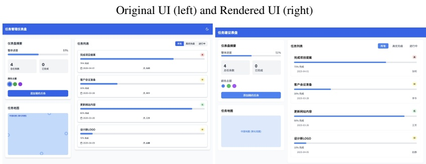

Prompt: Please develop a similar-looking UI and provide the complete React component code.

Model Response.

<think>...</think><answer>

<html>\n<head>\n<meta charset=\"UTF-8\">\n<meta name=\"viewport\" content=\"width=device-width, initial-scale=1.0\">\n<title>任务建议表盘</title>\n<script src=\"https://cdn.jsdelivr.net/npm/react@18.0.0/umd/react.development.js\">\n<script src=\"https://cdn.jsdelivr.net/npm/react-dom.development.js\">\n<script src=\"https://cdn.jsdelivr.net/npm/babel/standalone/babel.js\">\n<script src=\"https://cdn.tailwindcss.com\">\n<link rel=\"stylesheet\" href=\"https://cdnjs.cloudflare.com/ajax/libs/font-awesome/5.15.3/css/all.min.css\">\n<link href=\"https://fonts.googleapis.com/css2?family=Noto+Sans+SC:wght@400;500;700&display=swap\" rel=\"stylesheet\">\n<style>\nbody {\nfont-family: \'Noto Sans SC\', sans-serif;\nbackground-color: #f5f7fa;\n}\nprogress-bar {\nheight: 8px;\nborder-radius: 4px;\n}\n.color-circle {\nwidth: 24px;\nheight: 24px;\nborder-radius: 50%;\ncursor: pointer;\ndisplay: inline-block;\nmargin-right: 10px;\n}\n</style>\n</head>\n<body>\n<div id=\"root\"></div>\n\n<script type=\"text/babel\">\nconst Header = () => {\nreturn (\n<header className=\"bg-blue-600 text-white p-4 flex justify-between items-center\">\n<h1 className=\"text-xl font-bold\">任务建议表盘</h1>\n<button className=\"text-white\">\n<i className=\"fas fa-moon\">\i>\n</button>\n</header>\n\n);\n};\n\nconst DashboardSummary = () => {\nreturn (\n<div className=\"bg-white rounded-lg p-5 shadow-sm mb-5\">\n<h2 className=\"text-lg font-medium mb-4\">仪表盘摘要</h2>\n\n<div className=\"mb-6\">\n<div className=\"flex justify-between mb-1\">\n<span className=\"text-gray-600\">整体进度</span>\n<span className=\"text-gray-600\">51%</span>\n</div>\n<div className=\"w-full bg-gray-200 rounded-full h-2\">\n<div className=\"bg-blue-500 h-2 rounded-full\" style={{width: \'51%\'}}></div>\n</div>\n</div>\n<div className=\"grid grid-cols-2 gap-4 mb-6\">\n<div className=\"bg-gray-100 p-4 rounded-lg\">\n<div className=\"text-2x1 font-bold text-gray-800\">4</div>\n<div className=\"text-gray-600\">总任务数</div>\n</div>\n<div className=\"bg-gray-100 p-4 rounded-lg\">\n<div className=\"text-gray-600\">已完成</div>\n</div>\n</div>\n<div className=\"mb-6\">\n<h3 className=\"text-gray-600 mb-2\">...</html>

</answer>

<div align="center">

Figure 7: A case showing the ability of generating the front-end code from a UI snapshot.

</div>

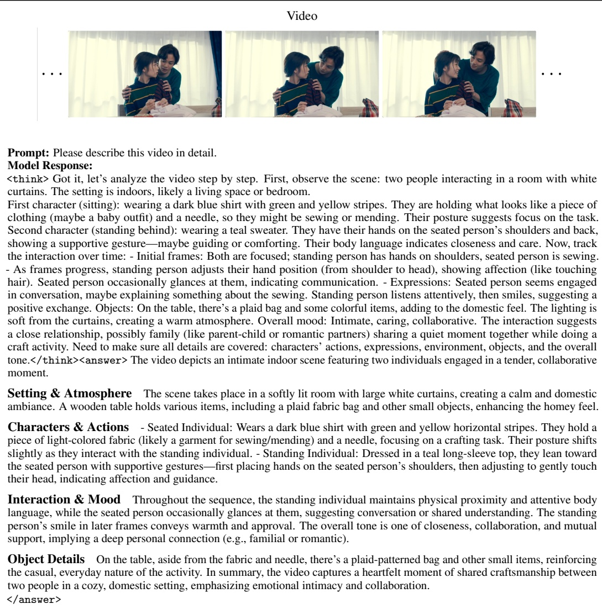

<div align="center">

Figure 8: A case showing the ability of giving detailed and precise description for a video.

</div>

## A.3 Video Description (in Chinese)

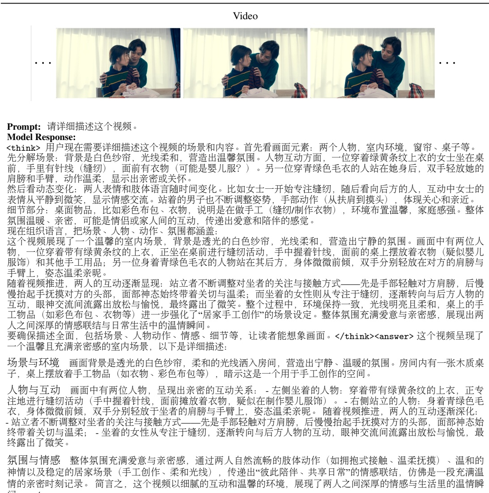

氛围与情感整体氛围充满爱意与亲密感，通过两人自然流畅的肢体动作（如拥抱式接触、温柔抚摸）、温和的神情以及稳定的居家场景（手工创作、柔和光线），传递出“彼此陪伴、共享日常”的情感联结，仿佛是一段充满温情的亲密时刻记录。简言之，这个视频以细腻的互动和温馨的环境，展现了两人之间深厚的情感与生活里的温情瞬间。</answer>

<div align="center">

Figure 9: A case showing the ability of giving detailed and precise description for a video.

</div>

<div align="center">

Video

</div>

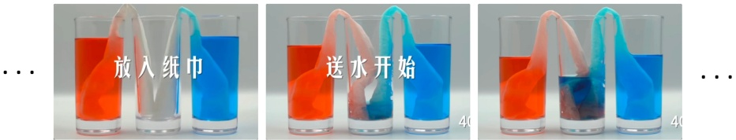

## Prompt: 这个现象发生的原因是什么？为什么中间水杯会有水？

## Model Response:

<think>用户现在需要解释这个实验现象的原因。首先看图片里的元素：三个玻璃杯，左右是红色和蓝色液体，中间是空的，中间有纸巾连接左右杯子。这是毛细现象（或渗透作用）的演示。

首先分析原理：纸巾作为多孔材料，具有毛细作用（capillary action）。当两端存在液面高度差时，液体通过毛细管（这里纸巾的纤维间隙类似毛细管）移动。左边红液、右边蓝液，中间纸巾建立通道后，由于液体在纸巾中的毛细作用，会从低浓度（或低液位？不对，应该是液体的流动方向由压力差等，但更简单的是毛细现象导致液体通过纸巾移动到中间空杯中，直到两侧液面平衡或者形成某种混合？

不过更准确地说，这是展示水的毛细运动（capillary movement），即液体在细小管道（这里是纸巾的纤维向缝隙）中因表面张力等因素向上或向下的移动。当左右两杯有不同颜色的液体，中间用纸巾连接，纸巾吸收水分后会通过毛细作用将水输送到中间的空杯里，因为纸巾的吸水性使得水沿着纤维间的通道移动，从而让中间的水杯逐渐被水填满。

所以原因是因为纸巾具有毛细作用（或毛细现象），能够吸收并输送液体，使得左边的红色液体和右边的蓝色液体通过纸巾的纤维间隙（类似毛细管）进入中间的空杯中，最终中间杯子里有了水（其实是两种颜色液体的混合？不，可能刚开始是分别从两边吸水，然后中间积累）。因此，中间水杯有水是因为纸巾利用了毛细现象，将左右两侧的液体通过自身的纤维结构输送到中间的空杯中，导致中间杯子里出现液体。总结步骤：

1. 识别实验装置：三个玻璃杯，左右装有色液体，中间空，中间有纸巾连接。2. 确定物理原理：毛细现象（或毛细作用），纸巾的多孔性使其能吸附液体并通过纤维间的通道输送。3. 解释过程：纸巾吸收左侧红色液体和右侧蓝色液体，通过毛细作用将这些液体输送到中间的空杯中，因此中间水杯里有水（实际上是两种液体通过纸巾的毛细作用流入中间杯）。

所以答案要说明是毛细现象（或毛细作用），纸巾的吸水和导水能力导致中间杯有水。</think><answer>这个现象是由于**毛细现象（或毛细作用）**导致的。具体来说：纸巾是多孔材料，其纤维之间的缝隙类似于“毛细管”。当左右两个装有不同颜色液体的杯子与中间的空杯之间用纸巾连接时，纸巾会利用自身吸水性和纤维间的毛细作用，将左侧红色液体和右侧蓝色液体通过纤维间隙输送至中间的空杯中。随着这种输送过程的进行，中间的空杯逐渐被液体填满，从而出现了“中间水杯有水”的现象。该现象是由毛细现象（或毛细作用）引起的，纸巾通过其多孔结构的毛细作用，将左右两侧的液体输送至中间的空杯中，使中间水杯内出现液体。

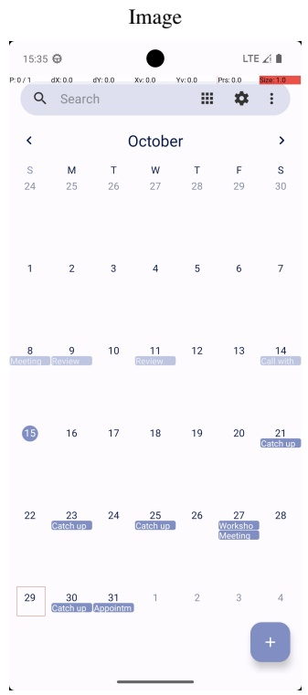

Prompt: In Simple Calendar Pro, create a calendar event in two weeks from today at 3h with the title 'Meeting with Dr. Smith' and the description 'We will discuss marketing strategies.'. The event should last for 15 mins.

Model Response:

<think> Let me analyze the current screenshot: 1. This is the Simple Calendar Pro app showing the calendar view for October.

2. The calendar displays dates from October 1-31, with days of the week labeled as S, M, T, W, T, F, S at the top. 3. Today appears to be October 15th, as indicated by the blue highlighted circle around the number 15 in the fourth row. 4. The task requires creating an event in two weeks from today (October 15th) which would be October 29th. 5. Looking at the bottom of the calendar, I can see the dates 29-31 of October. October 29th would be the date we need according to the task (two weeks from today). 6. I can see various existing events on different dates in October: - October 8th has a "Meeting" event - October 9th has a "Review" event - October 11th has a "Review" event - October 14th has a "Call with" event - October 21st has a "Catch up" event - October 23rd has a "Catch up" event - October 25th has a "Catch up" event - October 27th has a "Worksho" (likely "Workshop") and "Meeting" events - October 30th has a "Catch up" event - October 31st has an "Appointm" (likely "Appointment") event; 7. There’s a floating action button (FAB) with a plus sign at the bottom right, which is used to add new events.

Looking at my previous steps: 1. I opened the Simple Calendar Pro app. 2. I clicked the floating action button (plus icon) to start creating a new event. 3. In the last step, I clicked what appears to have been a section of the screen but the precise element isn’t clear from the history.

Based on the current screenshot and the task requirements: - Today is October 15th - Two weeks from today would be October 29th - I need to select October 29th to create our event - After selecting the date, I’ll need to add the event details: title, description, and time

The current calendar view shows all of October, and October 29th is visible at the bottom left portion of the calendar. Since my last action may not have correctly selected the date area, I need to click directly on the date October 29th to select it before adding the event details.

Next steps: 1. Click directly on the date October 29th in the calendar 2. After selecting the date, I’ll expect to be taken to an event creation form 3. Then I’ll enter the event title, description, and time as specified in the task

For the event details needed: - Title: 'Meeting with Dr. Smith' - Description: 'We will discuss marketing strategies.' - Time: 3h - Duration: 15 mins

So my next action should be to click on October 29th to select it as the date for our new event. This will likely take me directly to the event creation interface where I can add all the required details.</think><answer> Action:

{“action_type": "click", "box_2d": [27,840,122,885]}

</answer>

<div align="center">

Figure 11: A case showing the ability of GUI recognition and operation.

</div>

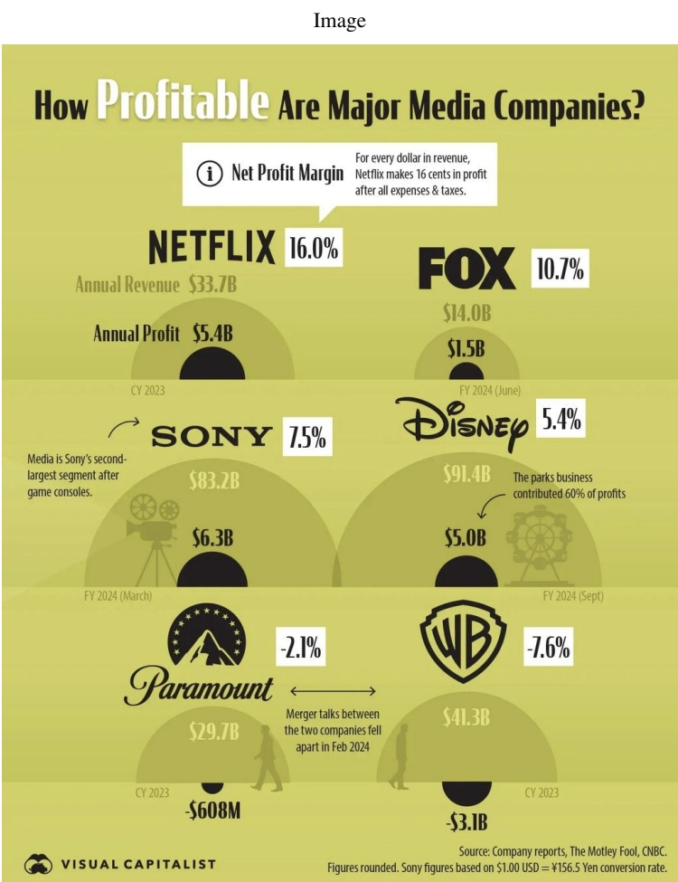

<div align="center">

Figure 12: A case showing the ability of chart understanding and question answering.

</div>

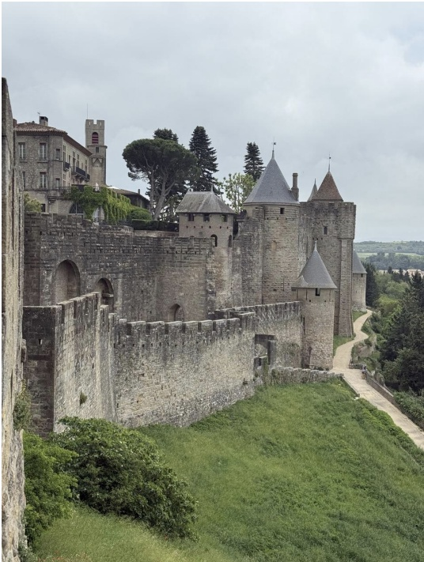

## Model Response:

<think>用户问的是“这里可能是哪里？”，然后给了一张图片的描述。首先，我需要根据描述来分析图片中的建筑特征。图片中有一座古老的城堡，石墙和塔楼，塔楼有尖顶，还有拱形的门洞，周围有绿色的植被和一条小路。建筑风格看起来像是中世纪的防御工事，可能属于欧洲的某个历史悠久的城市。

首先，中世纪的城堡常见于欧洲，比如法国、德国、意大利等地。法国的卡尔卡松城堡非常有名，以其保存完好的中世纪城墙和塔楼著称，周围有护城河和绿地。卡尔卡松的城墙分为内城和外城，塔楼形状多样，有圆形和方形的，屋顶是灰色的，符合描述中的尖顶和石墙结构。另外，图片中的建筑周围有树木和草地，地势可能较高，俯瞰下方，这也符合卡尔卡松的地理位置，位于一个高地上，周围有平原和植被。

接下来，考虑建筑细节。石墙的材质是灰色的石块，表面有岁月的痕迹，显示出历史的悠久。塔楼的结构紧凑，带有防御性的设计，比如小窗户和突出的位置，便于观察和防御。旁边的建筑有红色的屋顶，可能是后期修复或添加的部分，但整体风格统一，属于中世纪防御体系的一部分。

另外，周围的环境有蜿蜒的小路，可能是供游客参观的步道，说明这是一个旅游景点。卡尔卡松作为世界文化遗产，确实有完整的城墙和塔楼供人参观，周围的自然景观也符合描述中的草地和树木。

再考虑其他可能性，比如德国的霍亨索伦城堡，但结构不同，霍亨索伦更多是宫殿风格。意大利的城堡可能更偏向文艺复兴风格，而这里的建筑更偏向中世纪的防御性。西班牙的城堡也有可能，但法国的卡尔卡松在保存完好的中世纪城墙方面更为突出，且塔楼的设计和数量与描述相符。

总结一下，关键特征：中世纪防御城堡，石墙，尖顶塔楼，周围绿地，可能位于法国。结合这些特征，最可能的结论是法国的卡尔卡松城堡。</think><answer>从图片中的建筑特征来看，这是一座典型的中世纪防御性城堡。石砌的城墙厚重坚固，带有多个拱形门洞和垛口，显示出防御功能。塔楼形状多样，有尖顶和圆顶结构，部分塔楼顶部设有小窗，符合中世纪城堡的防御设计。城墙周围是绿色的草地和植被，地势略有起伏，一条蜿蜒的小路沿城墙延伸，可能是供游客参观的步道。建筑材质为灰色石块，表面有岁月侵蚀的痕迹，体现出历史的悠久。

中世纪欧洲的城堡中，法国的卡尔卡松城堡以其保存最完整的中世纪城墙和防御体系闻名，其特征包括多层城墙、不同形状的塔楼（如圆形和方形塔楼）、尖顶屋顶以及周边的自然环境。卡尔卡松位于法国南部，地势较高，俯瞰下方的平原和植被，与图片中的场景高度吻合。此外，卡尔卡松的城墙和塔楼在修复后仍保留了原始的中世纪风貌，且作为世界文化遗产，周边有供游客游览的步道，符合图片中展现的旅游场景。结论：这里可能是法国的卡尔卡松城堡。

<div align="center">

Figure 13: A case showing the ability of inferring the geographic position from a picture.

</div>

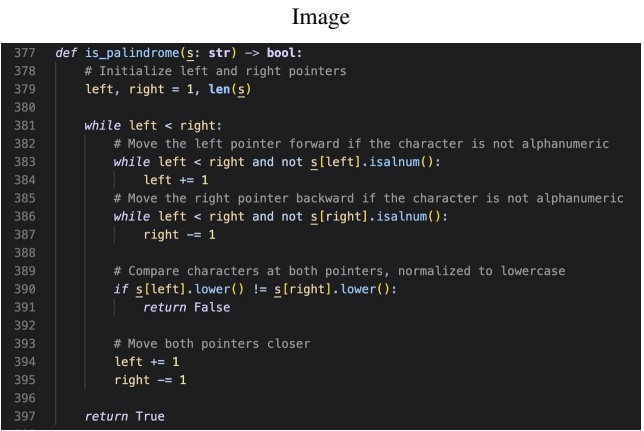

def is_palindrome(s: str) -> bool:

    # Initialize left and right pointers correctly

    left, right = 0, len(s) - 1

    while left < right:

        # Move the left pointer forward if the character is not alphanumeric

        while left < right and not s[left].isalnum():

            left += 1

        # Move the right pointer backward if the character is not alphanumeric

        while left < right and not s[right].isalnum():

            right -= 1

        # Compare characters (normalized to lowercase)

        if s[left].lower() != s[right].lower():

            return False

        # Move both pointers closer

        left += 1

        right -= 1

    return True

Explanation:

The primary bug was the incorrect initialization of left and right pointers. By setting left = 0 and right = len(s) - 1, we ensure the pointers start at the first and last valid characters, respectively. This fixes potential index errors and ensures proper comparison across the entire string.

</answer>

<div align="center">

Figure 14: A case showing the integrated ability of code recognition, debugging and correction.

</div>

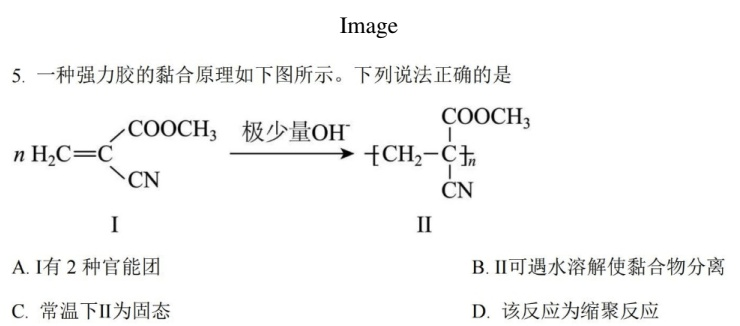

<think>..</think><answer>要解决这道题，需逐一分析选项并结合化学反应原理判断：选项A分析I的官能团判断：单体I的结构为 $ \mathrm{H}_{2}\mathrm{C}=\mathrm{C}(\mathrm{COOCH}_{3})\mathrm{CN} $ ，其含有的官能团需明确：碳碳双键（C=C）：决定加成反应能力的官能团；酯基（ $ -\mathrm{COOCH}_{3} $ ：由羧酸与醇形成的官能团；腈基（ $ -\mathrm{CN} $ ：含氮的官能团。因此，I含有3种官能团，而非2种，选项A错误。选项B分析Ⅱ的水溶性判断：聚合物Ⅱ是单体I经加聚反应生成的高分子化合物（结构为 $ [\mathrm{CH}_{2}-\mathrm{C}(\mathrm{COOCH}_{3})\mathrm{CN}]_{n} $ ）。虽然酯基（ $ -\mathrm{COOCH}_{3} $ ）具有一定亲水性，但高分子量的聚酯类物质一般难溶于水（小分子酯易溶，但高分子链段间作用力强，无法溶解于水）。因此，Ⅱ不可因遇水溶解而使黏合物分离，选项B错误。选项C分析Ⅱ的状态判断：聚合物Ⅱ是由多个单体通过加聚反应形成的高分子化合物，这类高分子的分子量通常较大（可达数千至数万以上）。根据高分子材料的性质，常温下高分子化合物多为固态或半固态（类似塑料、橡胶等形态）。因此，常温下Ⅱ为固态，选项C正确。选项D分析反应类型判断：缩聚反应的特征是有小分子（如水、醇、氨等）生成，而加聚反应则是单体通过加成反应直接形成高分子，无小分子析出。本题中，单体I在极少量 $ (\mathrm{OH}^{-}) $ 催化下，仅发生碳碳双键的加成聚合，生成高分子Ⅱ，过程中未产生任何小分子，因此该反应属于加聚反应，而非缩聚反应，选项D错误。综上，正确的说法是选项C。

</answer>

<div align="center">

Figure 15: A case showing the ability of solving Chemistry problem.

</div>

## A.10 Math Problem Solving

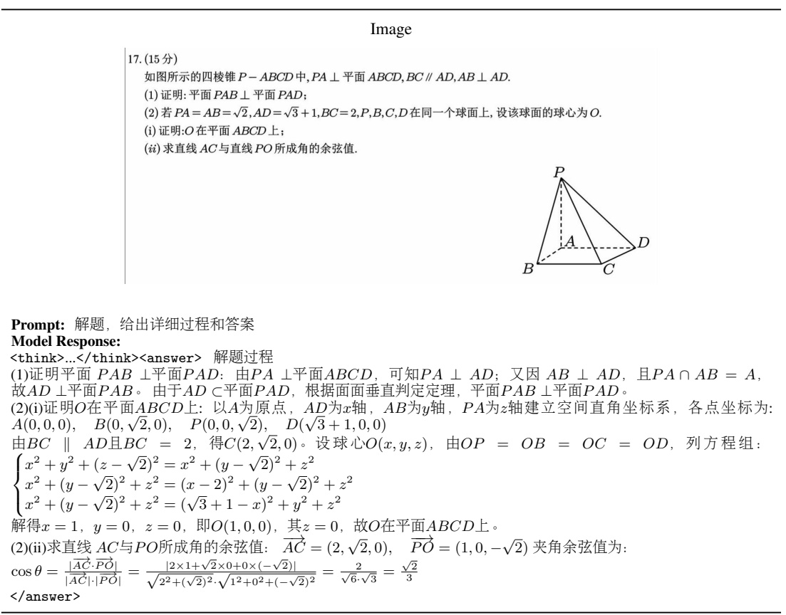

<div align="center">

Figure 16: A case showing the ability of solving complex Math problem.

</div>

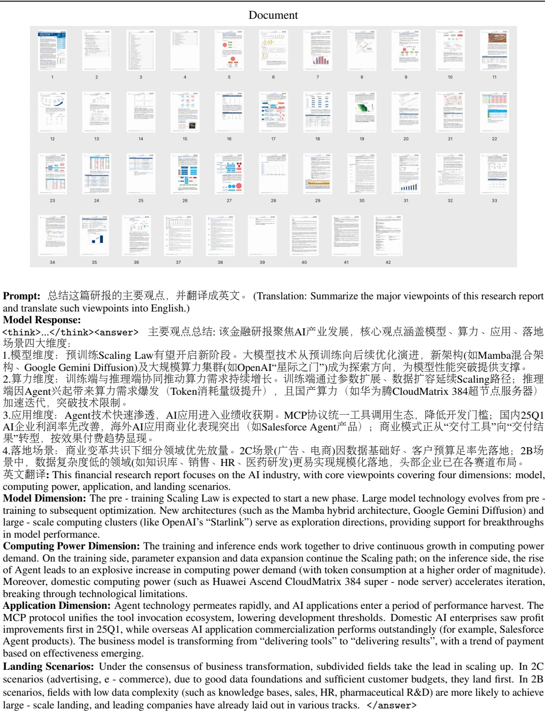

<div align="center">

Figure 17: A case showing the ability of deeply interpreting a long document.

</div>

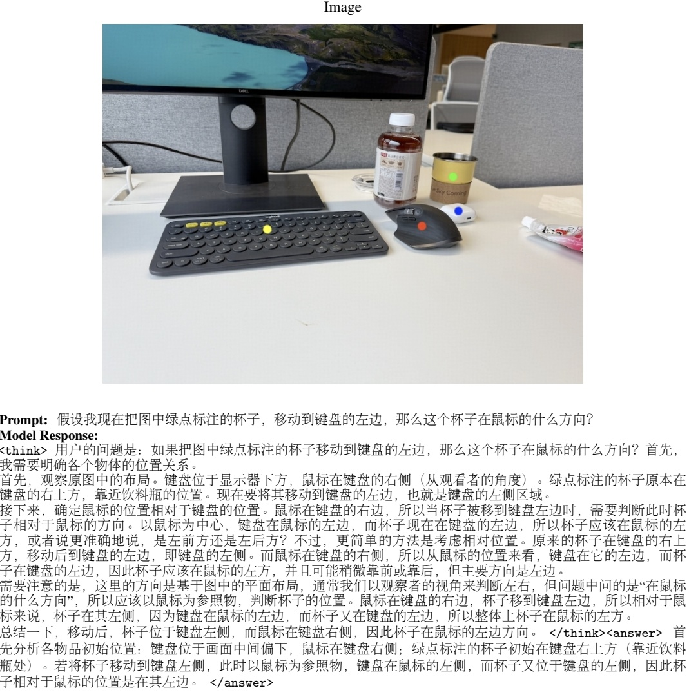

<div align="center">

Figure 18: A case showing the ability of complex spatial reasoning.

</div>

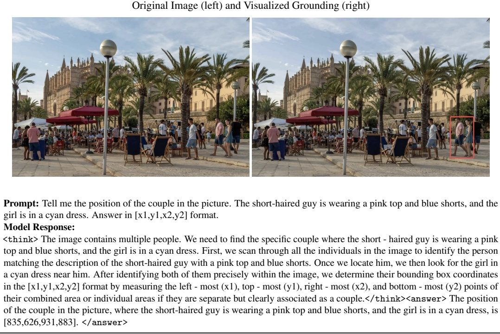

<div align="center">

Figure 19: A case showing the ability of visual grounding.

</div>

## B Evaluation Protocols and Instructions

## B.1 Evaluation Protocol of VLM Coding

To assess the HTML code generation capabilities of GLM-4.1V-Thinking and GLM-4.5V, we follow the "direct" evaluation setting described in Design2Code [43], omitting both text augmentation and self-revision steps. In contrast to [43], we employ GPT-o4-mini as the visual judge to compare each rendered HTML output against the corresponding UI reference screenshot. This choice is motivated by our empirical observation that GPT-o4-mini consistently produces similarity judgments that are more accurate and more closely aligned with human preferences than those obtained from CLIP, particularly in the presence of complex UI layouts. The scoring prompt provided to GPT-o4-mini is as follows:

I will give you two images. The first is the reference, and the second is generated from the first via code rendering. Please rate their similarity from 0-100, where 0 means completely different and 100 means identical. Provide the score inside a LaTeX \boxed{} and briefly explain your reasonin

We take 80 as the score threshold for a faithful UI2Code reproduction and report accuracy as the proportion of test cases meeting this criterion (score $ \geq 80 $ ). This choice is based on our observation that rendering differences in resolution, fonts, and other factors make a perfect score of 100 impractical almost all results would be judged "inconsistent," distorting the evaluation. Human raters focus on overall layout, colors, and elements rather than pixel-level differences, and in our manual evaluation, cases with VLM-assigned scores $ \geq 80 $ were generally considered visually and functionally consistent with the reference.

## B.2 GUI Agent Instructions

To achieve optimal performance and reproduce the results presented in the paper when utilizing GLM-4.1V-Thinking or GLM-4.5V as a GUI Agent on mobile phones and computers, it is essential to follow the specific prompts and settings outlined in https://github.com/zai-org/GLM-V/ blob/main/examples/gui-agent/glm-41v/agent.md (for GLM-4.1V-Thinking) or https://github.com/zai-org/GLM-V/blob/main/examples/gui-agent/glm-45v/agent.md (for GLM-4.5V).

## B.3 Visual Grounding Instructions

To reliably trigger the grounding behavior of GLM-4.5V or GLM-4.1V-Thinking and reproduce the evolution results reported in the paper, we suggest using prompts similar to the format shown below.:

- Help me to locate <expr> in the image and give me its bounding boxes.

- Please pinpoint the bounding box [[x1,y1,x2,y2],...] in the image as per the given description. <expr>

In the prompts, <expr> is the description of the target object, and the bracket style may vary ([], (), <>, {} , etc.). Each output bounding box will be a quadruple $ [x_{1}, y_{1}, x_{2}, y_{2} ] $ composed of the coordinates of the top-left and bottom-right corners, where each value is normalized by the image width (for x) or height (for y) and scaled by 1000.

## C Experimental Results of GLM-4.1V-9B-Thinking

The comparison of GLM-4.1V-9B-Thinking with baselines under 10B parameters is provided in Table 3. GLM-4.1V-9B-Thinking sets a new state-of-the-art across 23 out of 28 benchmarks among models under 10B parameters, including MiMo-VL [46], Kimi-VL [50], InternVL3 [72], and Qwen-VL series [4].

<table border="1"><tr><td>Task</td><td>Benchmark</td><td>GLM-4.1V-9B-Thinking</td><td>Qwen2.5-VL7B</td><td>InternVL39B</td><td>Kimi-VLA3B-Thinking</td><td>MiMo-VL7B-RL</td><td>Qwen2.5-VL72B</td><td>GPT-4o2024-11-20</td></tr><tr><td rowspan="5">General VQA</td><td>MMBench-V1.1-EN</td><td>85.8</td><td>82.7</td><td>81.7</td><td>71.6*</td><td>79.4*</td><td>88.0</td><td>84.4*</td></tr><tr><td>MMBench-V1.1-CN</td><td>84.7</td><td>80.1*</td><td>80.9*</td><td>70.2*</td><td>80.3*</td><td>86.7*</td><td>83.2*</td></tr><tr><td>MMStar</td><td>72.9</td><td>63.9</td><td>66.3</td><td>62.3*</td><td>69.3*</td><td>70.8</td><td>66.2*</td></tr><tr><td>BLINK</td><td>65.1</td><td>45.7*</td><td>58.6</td><td>53.5*</td><td>62.4</td><td>58.0*</td><td>66.4*</td></tr><tr><td>MUIRBENCH</td><td>74.7</td><td>53.2*</td><td>51.4</td><td>56.8*</td><td>64.8*</td><td>62.9*</td><td>69.7*</td></tr><tr><td rowspan="7">STEM</td><td>MMMU</td><td>68.0</td><td>58.6</td><td>57.7</td><td>61.7</td><td>66.7</td><td>70.2</td><td>69.1*</td></tr><tr><td>MMMU-Pro</td><td>57.1</td><td>38.3</td><td>42.1*</td><td>45.5*</td><td>53.1*</td><td>51.1</td><td>54.6*</td></tr><tr><td>VideoMMMU</td><td>61.0</td><td>47.4</td><td>-</td><td>-</td><td>43.3</td><td>60.2</td><td>61.2*</td></tr><tr><td>AI2D</td><td>87.9</td><td>83.8*</td><td>84.6</td><td>78.1*</td><td>83.5</td><td>87.6*</td><td>84.8*</td></tr><tr><td>MathVista</td><td>80.7</td><td>68.2</td><td>71.5</td><td>71.3</td><td>81.5</td><td>74.8</td><td>64.0*</td></tr><tr><td>WeMath</td><td>63.8</td><td>31.0*</td><td>33.8</td><td>36.0*</td><td>66.3</td><td>46.0*</td><td>44.4*</td></tr><tr><td rowspan="3">OCR &amp; Chart</td><td>ChartQAPro</td><td>59.5</td><td>38.0*</td><td>36.1*</td><td>44.1*</td><td>53.6*</td><td>46.7*</td><td>49.4*</td></tr><tr><td>ChartMuseum</td><td>48.8</td><td>27.2*</td><td>21.5*</td><td>29.3*</td><td>44.4*</td><td>39.6*</td><td>42.7*</td></tr><tr><td>OCRBench</td><td>84.2</td><td>84.5*</td><td>87.7</td><td>78.7*</td><td>86.6</td><td>85.1*</td><td>81.1*</td></tr><tr><td>Long Document</td><td>MMLongBench-Doc</td><td>42.4</td><td>25.1*</td><td>20.4*</td><td>35.1</td><td>24.9*</td><td>35.2*</td><td>41.0*</td></tr><tr><td>Visual Grounding</td><td>RefCOCO-avg(val)</td><td>87.4</td><td>87.1†</td><td>88.7</td><td>-</td><td>89.6</td><td>90.2†</td><td>-</td></tr><tr><td rowspan="5">GUI Agents</td><td>OSWorld</td><td>14.9</td><td>1.9*</td><td>1.4*</td><td>8.2</td><td>1.9*</td><td>8.8</td><td>5.0†</td></tr><tr><td>AndroidWorld</td><td>41.7</td><td>27.6†1</td><td>1.9*</td><td>-</td><td>10.8*</td><td>35.0</td><td>34.5†2</td></tr><tr><td>WebVoyageSom</td><td>69.0</td><td>14.1*</td><td>19.5*</td><td>1.8*</td><td>34.0*</td><td>40.4*</td><td>59.4*</td></tr><tr><td>Webquest-SingleQA</td><td>72.1</td><td>53.5*</td><td>39.3*</td><td>56.8*</td><td>64.0*</td><td>60.5*</td><td>57.0*</td></tr><tr><td>Webquest-MultiQA</td><td>54.7</td><td>39.4*</td><td>26.4*</td><td>42.0*</td><td>47.5*</td><td>52.1*</td><td>52.8</td></tr><tr><td rowspan="2">Coding</td><td>Design2Code</td><td>64.7</td><td>29.1*</td><td>15.3*</td><td>38.8*</td><td>28.7*</td><td>41.9*</td><td>35.3*</td></tr><tr><td>Flame-React-Eval</td><td>72.5</td><td>25.0*</td><td>11.3*</td><td>36.3*</td><td>8.8*</td><td>46.3*</td><td>75.0*</td></tr><tr><td rowspan="5">Video Understanding</td><td>VideoMME (w/o)</td><td>68.2</td><td>65.1</td><td>66.7</td><td>67.8</td><td>67.4</td><td>73.3</td><td>71.9</td></tr><tr><td>VideoMME (w/)</td><td>73.6</td><td>71.6</td><td>68.9</td><td>72.6</td><td>72.8*</td><td>79.1</td><td>77.2</td></tr><tr><td>MMVU</td><td>59.4</td><td>50.1</td><td>-</td><td>-</td><td>52.4*</td><td>62.9</td><td>61.4*</td></tr><tr><td>LVBench</td><td>45.1</td><td>45.3</td><td>-</td><td>-</td><td>37.1*</td><td>47.3</td><td>48.9</td></tr><tr><td>MotionBench</td><td>59.0</td><td>-</td><td>-</td><td>-</td><td>48.4*</td><td>-</td><td>58.0*</td></tr></table>

<div align="center">

Table 3: Comparison of GLM-4.1V-9B-Thinking with other models on diverse visual-language benchmarks. Results marked with $ ^{*} $ correspond to our reproduced results, while those marked with $ \dagger $ are reported by third-party sources. The best results among open-source models under 10B parameters are bolded.

</div>

$ ^{1} $ Tested with a predefined set of marks (SoM).

$ ^{2} $ Tested with the input of screenshot and accessibility tree.